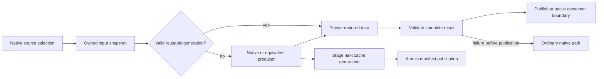

# Wake-Up: next ecosystem replacement campaign

## 22 September release and next direction

Owner approved commit, merge and publication of the tested Windows candidate as
0.3.0, with Linux/Deck still unqualified. The description must remain unchanged.
Parent completed release operations; no task owns edits. The existing tested
core and qualified quality helper were published without rebuilding. See the
[publication receipt](../release-0.3.0-publication.md).
On-demand loading is now explicitly excluded. The next campaign is early whole-stage
XML reuse, direct single-pass image decoding and overlap of independent loading
work; see [the new steward prompt](aggressive-loading-steward-prompt.md). Historical
retirements are not silently reversed; new mechanisms must prove useful benefit.
No new campaign implementation or performance window follows from this release step.

## Owner Windows Steam overnight qualification — 22 September 2026

At approximately 2026-09-22 06:33 UTC the owner left the PC overnight and authorized
Windows Steam qualification plus necessary retained-candidate work toward release
readiness. This supersedes the prior stop-before-Steam and closed-window notices.
The approval includes the prepared single-fixture qualification plan, its narrow
hash-pinned admission update, necessary correctness fixes/builds, fixture UI checks
using the Windows control skill, and bounded performance comparisons after correctness.
No new optimization pilot, retired path or deferred C10/C11/companion is restored.

As a conservative operating limit, finish measurements by 2026-09-22 14:00 UTC
(10 AM Toronto), earlier on owner return or revocation. The owner supplied no exact
cutoff; this is a steward limit. Do not start a sample unlikely to finish by then.
Never close normal games; all must already be stopped for performance. Preserve
other applications and exclude contested samples. Functional runs use existing
fixture-specific admission. Keep one operating owner and the single transactional
fixture, normal installations/data read-only, and restore the GOG baseline afterward.

Windows Steam approval is not publication approval. Linux/Deck remains its separate
later platform decision; do all useful authorized Windows work before raising it.
Do not merge, push, tag or publish. Prepare a brief plain-language comparison against
the last actual version-tagged release, verified locally, when qualification closes.
Resume the steward timer, review actual changes/evidence, and stop only on completed
authorized readiness or a concrete human-only blocker, not merely a subtask handoff.

## Implemented atlas retirement — 21 September 2026

Owner-approved retirement removes C07 static atlas caching and batching from
release activation, user options and optimization acceptance. Stale saved values
migrate off; legacy flags cannot install those hooks. Shared display scheduling
and observation remain: they schedule native loading units and are not wholly
native scheduling or a speed gain. See the [retirement report](c15a-atlas-retirement.md).

The atlas decision is resolved. Older pending-atlas and optimization-gate entries
below are historical. Performance and desktop control are closed; Steam admission
and promotion are explicitly deferred. Stop after focused GOG cleanup validation,
packaging and independent review. No successor or pilot.

## Owner atlas retirement and return to PC — 21 September 2026

The owner approved retiring static atlas caching and atlas batching, and requested
cleanup before stopping ahead of Windows Steam qualification. Remove their release
activation and optimization requirements; use native atlas behavior. Preserve shared
foundations needed by the retained loading display and keep research/history. This
is not approval to remove the display or other retained features.

The owner is using the PC again: the overnight performance and fixture desktop-control
window has ended. No performance measurements, microbenchmarks or desktop automation.
Standing isolated GOG correctness permission remains, with the established fixture-
specific process guard and incidental-focus allowance; use only focused checks needed
for this cleanup. No Steam qualification or admission update, Deck, normal-data edits,
merge, push or publication. Refresh the private candidate, independently review it,
then stop and pause the steward timer before Steam. No new optimization pilot.

## Current private closeout — 21 September 2026

Bounded GOG correctness, agent-operated quality/reset and ordinary menu/focus UI,
and the final workload-specific measurements are accepted by the steward. Tested
core remains `90844467`; this closeout changes only qualification metadata, docs
and the private source-inclusive archive. The [current summary](../current-state.md)
and [candidate report](c15a-retained-candidate.md) replace obsolete next steps below.

Atlas release treatment awaits the owner; preserve activation/defaults meanwhile.
No all-options speed claim is supported, even without atlas. No further measurement
or proposed PNG pilot is assigned. The [Windows Steam approval plan](windows-steam-qualification-plan.md)
is preparation only; Steam, later Linux/Deck and publication retain separate gates.
The older dated notices below record historical authority and decisions.

## Owner overnight closeout authorization — 21 September 2026

At 2026-09-21 07:06 UTC (03:06 Toronto), the owner left the PC overnight and
asked for autonomous testing, fixes and iteration toward a release-ready retained
candidate by roughly 10–11 AM. Performance testing and Windows control skill UI
interaction are explicitly authorized for this window. The proposed new PNG
optimization is explicitly excluded; C10/C11/companion and the six retired paths
remain deferred/retired. This notice supersedes older no-performance, no-desktop-
automation and owner-only visual-inspection limits for the authorized fixture work.
Record agent-observed UI evidence honestly, not as owner inspection.

Use 2026-09-21 14:00 UTC (10 AM Toronto) as a conservative measurement cutoff,
ending earlier on owner return/revocation. Do not start a sample that cannot finish
before cutoff. The unrelated project may continue; do not control its applications.
Exclude resource-contested measurements, pause our competing builds/scans during
measurement, and preserve all game/process guards. Never close a normal game to
obtain idle measurements. Use the single fixture and serial ownership; keep normal
data untouched. Separate platform-promotion and merge/push/publication approvals
remain unchanged; complete all useful currently authorized GOG work before surfacing
any remaining platform decision. Routine fixture UI checks no longer need owner
participation. Resume the five-minute steward timer and avoid needless process work.

## Historical inspection and pilot proposal — 19 September 2026

The owner-inspection pause recorded at this checkpoint was superseded by the
21 September authorized agent UI checks and accepted measurement closeout.
The [single PNG pilot proposal](next-pilot-proposal.md) remains unapproved and is
explicitly excluded from the current work. Use the current summary above.

## Owner-approved retained baseline amendment — 19 September 2026

The owner approved removing six repeatedly slower paths from this release's active
features and required optimizations: independent parsed-XML caching (C01),
inheritance caching (C02 branch), speculative ordered XML reads (C03), parsed-language
persistence (C04 branch), faithful recaching of authored DDS textures (C05 branch),
and the current managed first-build image acceleration (C06 branch). Use ordinary
native game behavior for these operations. Preserve their research, history and
independently useful foundations. These are explicit capability omissions from
this release, not successful conservative optimizations or complete supplier replacement.

Retain processed-only XML, translation application and warm PNG reuse within their
measured conditions; preserve explicit C08 quality conversion, routes, atlas/search
work and useful display/diagnostic/background features subject to remaining checks.
C07/C09/C12 remain provisional until measured; lack of measurement is not a failure.
On-demand assets C10, progressive detail C11 and companion app remain deferred.

Sequence now: **C06 recovery review → C15A candidate cleanup and bounded combined GOG
correctness → remaining concrete subsystem/owner-assisted correctness → final combined
baseline → one bounded optimization pilot proposal and authorized measurements**.
C15A may proceed before full C14 acceptance to make useful cleanup progress. It does
not waive C08 appearance/window checks or C14 actual unfocused loading, hold, focus
return, ordinary scene and native traversal gaps. Return subsystem corrections to
their responsible owners under serial checkout ownership. No general tier framework.

The interrupted C06 trial closed at `549dd5e2774a812078583086e652a17f67da48d9`.
The steward verified clean status, evidence hashes, seven restored baseline hashes,
eleven absences and stopped operations after fifteen owned rollbacks. No new runs
or measurements occurred during recovery. Warm evidence shows no helper starts;
the DDS-labelled capture includes two JPEG helper uploads and is not pure-DDS proof.
This is recovery closure, not C06 performance acceptance or installed helper adoption.

The per-feature review is recorded in
`artifacts/ecosystem-next-20260910/resume-20260919/performance-review.md`.
Historical conditional gains were about 0.20–0.25 seconds for processed-only XML,
1.04–1.49 seconds for French translation application and 2.86–3.48 seconds for warm
PNG reuse. They belong to their exact workloads/packages, are not additive, and do
not qualify the final combined source. The review records costs and changed premises
for the remaining provisional work. It does not establish that suppliers are less
safe or that compatibility checks caused the shortfall.

All earlier unattended windows are closed. No performance runs, microbenchmarks
or cost experiments until a fresh explicit owner grant. Standing non-disruptive GOG
correctness remains authorized. Windows Steam, then Deck/Linux promotion and
merge/publication retain their separate approval gates.

## Next C06 investigation: directly consumed helper pixels — 13 September UTC

The prepared-read integration repair passes independent review, but C06's
managed first-build decoding still loses to native loading. The next bounded
investigation uses the existing separate Windows helper to return decoded base
pixels directly. The rejected S09 route returned an expanded PNG that the game
then decoded again. Direct base-pixel consumption and a reusable child process
change those two premises; benefit is unknown until the complete path is measured.

**Two decision questions remain.** Can the existing Windows Imaging Component
(WIC) decoder produce the exact native-equivalent pixels, malformed-input
behavior and final texture descriptors/mips for admitted PNG/JPEG families?
Does decoded output delivered to the existing game-thread upload/finalization
beat the current managed path and native control after including process startup,
source/output transfers, conversion, waits and cleanup? A fast isolated decoder
or successful menu does not answer either question.

Use a separate versioned raw-output protocol, bypassing resizing, profile
normalization, helper mip generation and compression. Preserve row orientation,
channels, alpha, metadata and native quality. Reset per-image state, bound input
and output frames and correlate responses to requests. Send already leased source
bytes; the helper receives no source paths and performs no discovery, downloads
or output-file writes. Launch one owned hidden helper lazily only for actual
admitted cold work; reuse it within the loading session, then dispose it. Warm
cache and genuinely DDS-only work must not launch it. Keep native publication,
source revalidation, callback suspension, nested exclusion and ordered loading.

Account for parent and child encoded/decoded buffers, codec scratch and retained
outputs within the existing shared budget. The quality helper's current 256-MiB
process limit is not an additional free allowance for this route. Use a separate
bounded raw-mode process limit/reservation if needed. Existing 16-MiB input and
roughly 8-MiB prepared-output caps must not silently narrow C06 coverage; requests
that cannot fit the raw-mode budget retain the existing managed/native route and
remain explicitly represented in coverage. Own deadlines, stderr draining and
kill/join on cancellation, broken framing or child failure; never touch unrelated
processes. Preserve existing v2/v3 quality behavior and bundled dependencies.

This assignment authorizes implementation and testing **only as an isolated GOG
trial**, with explicit fixture activation and no installed-user automatic helper
execution/default change. The approved plan contemplated an opt-in helper path;
the later C06 report separately reserved automatic execution as a material
adoption decision. Do not silently broaden that later contract. First produce a
concrete candidate and its coverage, performance and memory consequences; resolve
that adoption decision before connecting it to installed-user activation. No new
third-party dependency or in-process native DLL is approved by this trial.

Use focused framing/cancellation/budget and native image checks before bounded
matched managed/native/helper consumed-output measurements during the active
unattended window. Qualify PNG and JPEG separately; differing WIC rounding or
malformed acceptance rejects the affected helper route, not the capability or
its existing managed coverage. If WIC fails, report exact mismatches and a
materially different implementation path (such as a reviewed exact decoder)
for the next decision. A small dependency-free alternative remains specializing
PNG reconstruction once per filter row, avoiding its current per-byte five-way
selection; its benefit and JPEG relevance are not established. Do not expand
this into a codec/profiling project or close C06 at a feasibility checkpoint.
C05 DDS, C06 broader coverage/performance, C14 correctness and C15 remain required.

## Prepared-read correction: suspend only for real quality collection — 13 September UTC

C05 metadata correction `a782b92e`, stopped `db26c9c6`, passes independent scoped
review but exposes a separate inherited C06 integration regression. Native-only
prepared loading discards warm results before `PreparedQualityRuntime.Loaded`
returns for an absent explicit-quality owner. It reads over 10,000 records for
2,840 uploads. The record retirement itself is correct at real callbacks; the
no-op boundary is unnecessary.

Return this bounded repair to original C06. Keep the existing startup/read
policy, explicit-quality slot presence and already-collected predicates local
to `Loaded`. These decisions use current in-memory data and release store locks
before further work. Only after collection is admitted, suspend immediately
before holder/content capture or `GetContentHolder`. A supplied before-collection
callback keeps the decision and boundary together without duplicated predicates.
Do not retain a no-owner decision across later callbacks or mutations. Keep
`BeforeYield`, mutation-driven warm retirement, full C08 checks, native ordering,
source revalidation and nested/current-upload accounting unchanged.

Focused absent-owner, present-owner and already-collected checks must establish
that genuine no-ops retain their warm work while real callbacks see no speculative
workers or handles. Demonstrate actual prepared native reuse and explicit-quality
collection/fallback in GOG using existing focused probes where adequate; no
counter-only substitute. Then use matched native/compressed/prepared controls
with the same independent seed. Expect unchanged prepared records to be read and
uploaded once, but require measured loading results separately. Return the bounded
result for independent review before another design. No new dependency/default,
quality reduction or removal of real callback protection is authorized.

The compressed DDS deficit and C06 standalone/combined decoding costs remain
separate open obligations; this repair does not claim to solve them. Broader
coverage, C14 correctness, C15 consolidation and later separately approved
platform qualification remain. C10/C11 and companion deferrals are unchanged.

## Reviewed C06 correction and next C05 metadata work — 13 September UTC

The separated pixel/source lifetime and strict-decoder correction at tested
`39178efb`, stopped `7585152f`, passes independent scoped correctness review.
It eliminates repeated completed decodes in combined construction but still
loses to native first-build and C05-only construction. C06 remains required;
its broader coverage and performance failures are not deferred or accepted.
Nested reload keeps the current outer upload charged until release and disables
inner queue admission, while retiring other outer buffers. This is the concrete
implementation of the earlier aggregate-budget requirement.

Use the next serial slot for original C05's previously queued advisory metadata
correction. Warm admission currently forces `FileInfo.Refresh` and `Length` on
the game thread for every planned image. Reuse a size already obtained during
native source selection where reliably available; it is only a reservation hint.
The worker must check the opened file's actual length before allocating/reading,
then retain full source hashing, stored-record validation and all publication
checks. A stale/missing hint must produce safe per-file fallback, never a false
cache hit, undercharged allocation or failure of the entire reload. Do not add a
new owner-thread metadata pass and call moved work a saving. Keep C06's stream
estimator, callback suspension/revalidation, queue bounds and native DDS precedence.

The changed premise targets measured owner-side admission cost, independently of
the previously tested hashing, handle reuse, parallel reads and duplicate-copy
corrections. Its useful benefit remains unproven. Use focused metadata-race and
shared-consumer correctness, final-source GOG native comparisons, then matched
DDS and conditional PNG controls; construction is a separate cost. Return the
bounded result even if insufficient, with the remaining cost and a materially
different next design stated. C05's DDS performance criterion is not waived.

C06 remains queued for its original owner after this serial slot. Its latest
worker decode totals (9.82–10.38 seconds summed, overlapping owner work) and
3.20–3.56 seconds of owner waiting identify a still-open decoding/coordination
problem; they do not establish a remedy. Further work must address those costs
with evidence and retain all quality/correctness/coverage requirements. Neither
more identical losing runs nor excluding the three slow JPEGs is a solution.
C14 correctness, C15 consolidation and remaining retained-feature measurements
stay required. No new dependency/default, C10/C11 resumption or platform permission.

## C06 correction: retained decoded pixels and strict decoder throughput — 13 September UTC

Current measurements establish two defects: standalone first-build decoding is
slower than native, and cache construction repeatedly throws away completed
decodes. The CPU-only retention experiment was retired because unknown GPU
callbacks still required draining almost every image. C06 remains required and
unaccepted. The next design changes the lifetimes of completed data and file
locks instead of expanding an uncertain GPU callback whitelist.

**Separate decoded data from file leases.** A completed cold result owns immutable
pixels, exact source content identity, selected position and memory reservation.
Closing its file stream must not erase those pixels or its eventual upload
receipt. Before entering an arbitrary callback or native GPU compression path,
stop admitting work, quiesce bounded workers, close all source/group streams and
discard warm/cache-dependent plans. Retain only successful completed cold buffers
inside the same eight-job/192-MiB budget. No workers restart during the callback;
repeated suspension is idempotent. Suspend before the whole compression/copy path,
not merely inside the later capture method.

Before ordered reuse, reopen the selected source with the existing read lease,
verify full content identity and current decoder/platform/callback eligibility,
and only then use retained pixels. Same-size/timestamp replacement must be detected.
Missing, changed, unreadable or incompatible input drops the retained decode and
uses the normal current-source path. Source verification scratch still counts
toward the shared bound; streaming verification may avoid another whole array.
Warm jobs remain generation-bound and are always retired on store mutation.
Cold retention is per-result, including mixed warm/cold intervals. Nested reload
and iterator disposal fully retire outer retained buffers to prevent overlapping
full budgets. Once pixels are actually uploaded, unlocking the source cannot
erase the receipt or replay the native continuation. No failures become successes.

**Improve the strict decoder independently.** Add a small prefix table to the
existing validated canonical Huffman trees; short codes can resolve directly and
long codes retain the existing slow path. Peeking must not consume unavailable
bits or invent EOF padding. Short valid final codes must still decode without a
full lookahead. Stored-block alignment discards alignment bits while preserving
whole bytes already buffered by lookahead. Retain tree/final-block/history/output
limits, cancellation, PNG CRC/Adler validation and existing native trailing-byte
behavior. Do not return to the inflater that accepted malformed missing-final
streams, add a dependency, or change admitted image families/defaults.

Implement and check these as distinguishable changes under the original C06
owner. Use focused decode boundaries and the existing source-rewriting callback
case: changed images must use updated pixels, unchanged subsequent images must
reuse completed work, and no speculative handles/workers may survive callbacks.
Ordinary combined construction should decode each unchanged eligible image once,
with actual upload receipts. Then use matched native/first-build, C05-alone/
combined, warm off/on and ordinary-DDS controls as needed to resolve changed
behavior. Fewer decodes are mechanism evidence; actual loading improvement is
still required. PNG throughput alone does not close the measured JPEG/DDS-path
overhead or broader open coverage. No C05 DDS waiver or C14/C15 completion follows.

## Qualification ordering after C05 buffer review — 13 September UTC

The authenticated-buffer correction at `72859aeb` passes independent scoped
correctness review but still fails DDS loading performance. Preserve this result
and the conditional PNG benefit; no C05 full acceptance or DDS scope waiver
follows. Use the next available serial measurement slot for original C06
first-build image qualification, isolated and combined with retained C05 storage.
Current final-source first-build correctness is available; measured performance
and previously unqualified format coverage remain separate obligations.

C05's next candidate, if resumed after that slot, removes duplicate owner-thread
metadata admission using advisory selection-time sizes and worker actual-length
checks before allocation. Preserve complete content authentication, bounded
reservations, native per-file fallback, callback staleness handling and unchanged
C06 stream/header estimation. Its cost and benefit are unknown; moving an IO
operation earlier alone is not an improvement. This candidate is recorded for
later bounded engineering, not implemented or measured, and C05 remains a
required retained capability. No new codec/dependency/default or product tradeoff
is approved. C14 correctness, C15 consolidation and later platform gates remain
in the owner-approved completion sequence.

## Steward engineering correction: authenticated texture buffer reuse — 13 September UTC

Parallel warm reads are implemented and independently reviewed at stopped
`6189941f`, tested `5bda4276`. They preserve useful PNG reuse but leave DDS texture
loading slower than native. The next bounded internal correction removes the
second full pixel-array allocation made after a stored record is authenticated.
Reuse the record's validated pixel range for synchronous Unity upload, preserving
all source, block, entry, descriptor and platform validation. This changes no
storage format, codec, dependency, setting, quality policy or replacement scope.

Keep a clear ownership contract: a warm result owns its complete authenticated
record; its pixel range cannot escape that lifetime. Validate the range and
descriptor before obtaining any native pointer, retain/pin the buffer only for
the synchronous upload, and release it on every success/failure/drain path.
Guard the exact upload entry point and any reachable configurable callbacks;
unsupported or changed contracts retain the correct existing owned-array path.
Existing preparation, quality, atlas and other owned-array consumers must retain
their semantics. Do not turn this correction into a general buffer-pooling rewrite.
The shared two-worker/eight-job/192-MiB ceiling still counts every live buffer,
waiting result and stream context accurately; lowering a reservation is allowed
only when the corresponding allocation is actually removed.

Use focused range/layout/corruption, lifetime and callback-fallback checks, actual
GOG native texture comparisons and one final-source retained C06 first-build
check. Then use the existing matched DDS native/compressed/prepared controls and
PNG benefit check under a current unattended grant. This is a different allocation
and materialization premise from the measured worker/handle corrections. Its gain
is unknown and may be too small to resolve all remaining costs; inspect real
results rather than assuming success from fewer copied bytes. The original C05
owner returns this bounded increment for independent review without silently
waiving DDS performance or starting another open-ended optimization series.
Any consequential new codec, dependency, default or scope proposal remains a
separate owner decision. Earlier implementation and failed measurements remain
history and evidence, not acceptance.

## Steward engineering correction: parallel warm texture reads — 13 September UTC

Measured retained texture reuse still loads DDS more slowly than native loading,
even after bounded file reuse and duplicate-hash removal. The next correction
moves eligible cached-data reading, validation and decompression to bounded CPU
workers, while creating textures in the existing native order on the game thread.
This is an internal implementation choice within approved C05/C06/C08 scope;
no product default, dependency, quality choice or exclusion changes. Performance
success is unknown and must be demonstrated; this design checkpoint does not
close the capability. [Measured premise](c05-texture-storage.md#matched-qualification-and-remaining-dds-cost--13-september-2026).

Keep `PngRuntime.Enumerate` as the ordered owner and preserve native file selection
and DDS precedence. Warm reuse must work when its existing settings are selected,
independently of the optional C06 first-build setting. Split store reads into:

1. Immutable owner/key/block read descriptions captured under the store's ownership
   lock, with engine/platform information captured on the main thread.
2. Source reading/full identity validation and block/record decoding on workers
   with independently positioned leased streams. Workers touch no Unity objects,
   mod holders, global current-file state, lazy startup store or mutable store
   accounting. Keep source leases through ordered consumption.
3. Ordered main-thread guard checks, texture restoration and usage/error accounting.
   Worker failures return outcomes; invalidation/publication occurs on the owner.

Drain or discard pending work before mutation or foreign callbacks, including
misses that require capture, invalidation, `CanPublish` pruning/checkpoint work,
quality group publication/reset, completion and disposal. Join workers outside
store locks. Copied plans must not outlive the store or a mutation boundary;
discard stale plans and reread after callbacks. A bare asynchronous call to the
current locked `cache.Read` cannot meet this design.

Native DDS fallback remains a callback boundary. Allow look-ahead across DDS only
for an admitted warm route whose restoration/holder callbacks retain their guards.
Preserve same-size/timestamp source-change detection and all source, block, entry,
descriptor and platform checks. Oversized or ineligible work uses the existing
correct serial path; it must not silently bypass explicitly requested preparation.

Use bounded jobs/workers and one aggregate speculative-memory budget shared with
C06. Reserve source bytes, compressed scratch, decoded record data, additional
pixel copies and waiting results; the existing C06 decoded-image estimate alone is
insufficient. This is eager startup preparation, not revived on-demand loading.

The original C05 orchestrator owns this correction serially, including necessary
C06/C08 internal integration; other original owners remain stopped. Use focused
same-group concurrent reads, corruption/staleness fallback, callback-driven source
replacement, cancellation/drain and retained first-build/quality checks, then
repeat the existing matched native/compressed/broad-prepared comparison. Preserve
PNG benefit and native pass-through behavior. Full acceptance requires useful
real loading performance without reduced coverage or correctness; unresolved
regressions return for further engineering rather than a completed ledger row.

## Owner-approved deferral and completion sequence — 13 September UTC

The owner directed us to defer on-demand loading and explicitly confirmed
“Defer progressive detail too”, prioritizing cleanup and completion of the other
features. **C10 / 5b and C11 / 5c are deferred from this release**, alongside the
optional companion app / 6c. The earlier implementation-direction proposal is
superseded without adoption. Preserve source, evidence and original criteria for
future work; do not call the deferred capabilities delivered or technically rejected.

The remaining sequence is **C14 background loading completion → C15 retained-feature
consolidation and combined GOG correctness → outstanding individual/combined
performance → explicitly approved Windows Steam → separately approved Linux/Deck**.
C14 uses ordinary native asset readiness and no longer depends on C10. Existing
functional reviews of C01–C09 and C12–C13 remain valid within their recorded limits;
their remaining correctness/compatibility obligations must close in consolidation.
Performance deficiencies, including C04/C05's recorded costs, remain real acceptance
obligations for the retained features. No deferred-asset performance campaign blocks
this release and no past prototype gain substitutes for a retained-feature result.

The functional completion target is a coherent candidate with retained XML,
language, ordered input, faithful image loading/storage, atlases, integrated native
preparation/explicit quality controls, asset routes, loading searches, progress/
profiler/diagnostics and loading-only background behavior working together. Deferral
of progressive detail does not remove ordinary full-quality textures, explicit
static quality choices or native lazy behavior. Broad successful route caching
(5a/C09) remains in scope independently of on-demand object creation.

C15 first audits candidate activation, settings, package contents and warnings.
Remove or disable current-release activation of C10 experimental texture/graphic/
audio paths and unadopted bootstrap dependencies; preserve dormant source/evidence
and any independently required shared infrastructure. Do not indiscriminately
revert ancestry or remove required Prepatcher/texture-helper behavior. Do not add
an unfinished option back to the user interface or claim FGL/YaOpt's deferred
features replaced. Corrections go to the responsible original owner under serial
ownership; retirement work is authorized maintenance, not resumed feature development.

Then close concrete retained-feature gaps with focused supplier-absent and combined
GOG checks: fresh/warm/invalidated inputs, native fallback, quality/reset/restart,
provider order, loading displays/report exports, save/world/map/new-colony lifecycle,
preferences and pause restoration. Close carried C08 in-game window/appearance
inspection and C14 real focus/completion behavior before declaring correctness
complete. Prepare one concise owner-assisted inspection when actual visible focus
checks are needed; no desktop automation or surprise focus changes. Do not turn
cleanup into a new framework, profiling platform or repeated historical audit.

Only after those checks may the steward report that remaining work is performance
and platform qualification. Performance requires a fresh explicit unattended window;
Windows Steam promotion still needs explicit approval after GOG acceptance, and
Linux/Steam Deck follows proven Windows Steam with its own authorization and any
necessary portability work. Mentioning these final gates does not authorize them
now. No merge, publication or normal-installation changes are implied.

## Proposed C10 implementation direction after prototype — NOT APPROVED — 13 September UTC

The corrected experiment now demonstrates useful pending texture/graphic/icon
work and native-quality first use on the tested GOG workload. Independent review
accepted the bounded evidence and its disabled-path correction, not full C10 or
release readiness. [Results and review](c10-demand-path-prototype.md#steward-correction-review--13-september-utc).

**Recommendation for owner decision:** adopt supported-demand loading as the
implementation direction for the optional, default-off asset feature and continue
the existing C10 slice through real colony/lifecycle and broader compatibility
work. This accepts the design's compatibility boundary for further implementation:
standard supported requests finish native-quality objects before returning;
known direct consumers complete the required populations eagerly; known worker
dependencies prepare before dispatch. Unsupported versions of a known integration
use ordinary eager behavior and may lose the loading benefit. Unknown direct
dictionary/reflected-field access and undeclared worker acquisition cannot be
guaranteed safe or automatically detected; affected workloads may need the optional
mode disabled until a concrete integration exists. That limitation must be stated
plainly in any later user-facing adoption proposal and compatibility guidance.

Approval would authorize development on that basis, not shipment, performance
testing, a blanket compatibility claim or a reduction in texture/graphic/icon/
audio family coverage. No supplier-removal recommendation follows until the
relevant useful behavior is delivered and reviewed. Full correctness, applicable
measured gains, smooth colony entry/first use and combined qualification remain
acceptance requirements. Any further material compatibility concession returns
to the owner. Current code stays explicitly experimental until adoption gates close.

The next bounded increment should exercise actual colony drawing and its worker
preparation, ordinary entry/save/reload and asset teardown; retain correct graphic,
icon, material and audio behavior; and test a useful broader mix including absence
or refusal of the known supplier integration. Extend PNG/PSD first-use coverage
where needed using existing native loaders, without a new codec/tooling project.
Choose a small representative workload, correct concrete failures in the same
C10 task and return for independent review. Deferred operation counts remain
functional evidence only; first-use latency, memory and loading gains await an
explicit unattended window. No C11 handoff until its actual prerequisites pass.

The alternative is to retain the original full-access compatibility requirement
and keep this experiment unadopted while seeking a materially different design.
That preserves the stronger promise, but no demonstrated solution currently
delivers broad native-quality deferral under it. Neither option excludes C10.
Dependent implementation is stopped awaiting this decision; existing GOG testing
permission remains in force and is not the reason for the gate.

## Owner-approved bounded C10 demand-path prototype — 13 September UTC

The owner approved trying the experiment described below: “sure, try this out”.
This authorizes a bounded implementation and isolated GOG correctness evaluation
with pending textures behind supported request routes, known worker dependencies
prepared before dispatch, and known direct/opaque consumers completed eagerly.
For this prototype, unchanged behavior for unknown direct/reflected access or
undeclared worker first acquisition is not guaranteed; automatic detection and
fallback for every unknown bypass must not be claimed.

Demonstrate real deferred texture/graphic/icon work after compatibility-driven
eager completion, native quality, correct supported first use and unchanged
ordinary disabled behavior. Quantify coverage using actual objects and operations;
do not infer performance gains from diagnostic timings. Keep it explicitly
experimental and default off. Return concrete coverage, limitations and evidence
to the steward before widening or proposing release adoption.

This approval supersedes the experimental implementation gate in the historical
proposal below only. It does not approve a release compatibility concession,
production adoption, reduced feature scope, full C10 acceptance, C11 handoff or
performance testing. Release adoption and material compatibility limits return
for a separate owner decision. The current active-PC prohibition remains in force.

## Pending C10 experiment decision — proposed, not approved — 13 September UTC

The engine-serialized texture experiment produced complete native-quality objects,
but consumed the full tested payload before making each object public. Independent
review rejects this candidate's post-publication deferral claim, not the capability.
[Evidence and concrete proposal](c10-serialized-texture-provider.md#steward-review-and-proposed-next-experiment--not-approved).

The proposed next bounded prototype would keep pending assets behind supported
demand paths, prepare known worker dependencies, and complete populations before
known direct/opaque access. Unlike the current full public-access requirement,
it would not promise unchanged unknown direct dictionary/reflection or undeclared
worker acquisition for pending assets. Unknown bypasses cannot be promised an
automatically detectable fallback. This assumption needs owner approval before
implementation; it is not an approved compatibility concession.

The prototype would have to demonstrate useful real texture/graphic/icon work
remaining deferred after compatibility-driven eager completion, native quality,
correct supported first use and unchanged ordinary off-mode. Approval to try it
would not accept coverage, reduce current release scope, authorize production
integration or waive performance. Results return for a separate explicit decision.
If the existing contract is retained, C10 remains open pending a newly concrete
native completion interface or sufficient private workload; neither is established.
No C11 dispatch, scope exclusion or further performance permission follows.

## Owner-approved sequence amendment — 12 September 2026 UTC

The owner approved the sequence proposed at `5b8bfaf` and directed the steward
to proceed: **C12 → C13 → C10 completion → C11 → C14 → C15**. This overrides
the original table's serial order and permits C12 before C10 functional acceptance.
C12 and C13 retain their own functional-review handoffs; C10/C11 remain required
before release. C10 returns to its existing orchestrator after C13. No feature,
compatibility or performance criterion is waived, and no new operational
permission is inferred. GOG correctness tests remain authorized; performance
testing awaits an explicit unattended window. The proposal below is retained as
the reviewed decision history; its pending-approval language is now superseded.

## Proposed sequence amendment — 12 September 2026 UTC — NOT APPROVED

Advance the independent loading-search and loading-display work, then return to
the unresolved asset-loading implementation. The proposed remaining order is
**C12 → C13 → C10 completion → C11 → C14 → C15**, with one editing/operating
team at a time. This changes work order only. C10 broad on-demand loading and
C11 progressive detail remain required before release; neither becomes optional,
accepted, excluded or post-release work.

The reason is a concrete failed prerequisite, not merely missing performance
measurements. C10's latest functional observation at `f48f5e73` establishes that
shared audio libraries are already exposed before its proposed startup safeguards
are installed. The conservative prepared-audio admission rule therefore refuses
the ordinary tested startup. The preserved draft supplies no replacement feature.
Earlier C10 results also leave complete texture publication and sound readiness
unresolved. Repeating those observations or expanding an inactive cache would not
deliver the missing behavior. See [C10 evidence and limits](c10-on-demand-assets.md).

C12's technical prerequisites are the reviewed C02/C04 implementations and
existing observation seams. C13 depends on C12 and earlier session events, not
on completed asset deferral. It must report native/eager asset work honestly and
leave actual C10/C11 event integration to those implementations. Its acceptance
must not claim unimplemented asset capabilities or recommend removing suppliers
whose useful behavior is still missing. Any newly discovered true dependency
returns to the steward before reducing the agreed deliverable.

If approved, the steward dispatches a fresh C12 task from the exact clean reviewed
commit after recording ownership. C12 and C13 each receive independent functional
review and same-orchestrator corrections before the next handoff. After C13,
ownership returns to the existing C10 orchestrator for a materially revised design:
an earlier supported protection boundary, a demonstrated way to account for prior
codec operations, or a different useful deferral boundary. No Prepatcher fork,
unsupported engine backend or reduced compatibility is approved by this sequence
change. Bring consequential dependency/compatibility choices to the owner with
concrete alternatives. C10 still requires working broad behavior; another
feasibility finding cannot qualify it for the C11 handoff.

This proposal temporarily bypasses section 8's previous-slice functional-review
prerequisite solely to start C12 while C10 remains open. The alternative is to
keep the approved order and continue C10 redesign now. Advancing C12/C13 delivers
independent features sooner but delays resolution of the campaign's largest
remaining architectural risk. The steward recommends the reordered sequence.
Existing GOG testing permission continues; performance awaits a new unattended
window. Full coverage, correctness, compatibility and actual performance gains
remain acceptance obligations. No successor is dispatched until this amendment
is approved.

## Owner-approved scope amendment — 11 September 2026

The owner explicitly made the standalone companion app and ordinary-user preparation before first full game load (**matrix 6c**) **OPTIONAL POST-RELEASE**, to prioritize the other features. This amends the initial approved scope at `f70aa08` without rewriting that historical approval. Preserve implemented app/source/packages/evidence as dormant optional work; do not accept it or claim full todds/ToDDS or external-workflow replacement. Row 6c is excluded from current C08 deliverables/acceptance, successor prerequisites and combined/release gates. References below to all agreed capabilities mean the amended current-release scope.

In-game native preparation and quality/sampling/reset/coverage (**6a/6b**), shared helper/runtime/native storage, broad routes, optional on-demand loading and all other approved features remain in scope. C08 source and automated functional review passed at `83a2930`. Remaining in-game window/scene appearance and native comparison/reset/restart checks must close in combined GOG correctness **before release**: they are not waived or passed by automated tests. This owner decision permits C09 after technical review and returned ownership without waiting for companion-app inspection or carried in-game visual checks. Performance remains a separate full-acceptance obligation requiring an unattended grant.

**APPROVED FOR IMPLEMENTATION — 10 September 2026.** The owner approved the reviewed plan at commit `f70aa081de2e5a9d50efa48b55d49ab8b27399b6` and directed the steward to proceed using this workflow. That commit preserves the proposed text. The approval adopts the matrix, architecture, slice sequence, recommended helper/budget/default/quality policies and exclusions, with the existing operational limits intact. See the [execution ledger](execution-ledger.md) for ownership and acceptance.

GOG functionality/correctness work is authorized. No unattended window has been declared, so performance testing is not authorized now. Windows Steam promotion, later Linux/Deck work, main integration and publication remain separately gated. References below to proposed choices describe the approved starting design; future material changes still require the owner decision specified here.

## What this plan would deliver

Wake-Up should let a player remove the corresponding loading suppliers while keeping their useful loading behavior. That requires independent XML and language reuse, broad texture processing and preparation, optional deferred assets, detailed loading information and complete loading-only background behavior. The existing search improvements, image fidelity work and cache maintenance remain valuable foundations. They do not make those missing capabilities complete.

The proposed architecture moves ownership earlier: Wake-Up prepares reusable data before native objects become visible, publishes complete objects at controlled boundaries, and schedules only work whose order is not observable. Most ordinary game processing and all unsupported custom behavior remain native. This permits deeper changes than adding another late method hook, while keeping failure handling understandable.

The sequence starts with independent XML reuse and its hard publication question, then languages, textures/quality, asset readiness, diagnostics and background coverage. The foundations ship with their first real consumer; there is no separate framework-building campaign. Difficult capabilities remain assigned through redesign. A completed feasibility report cannot close one.

Companion documents form part of this proposal:

- [Capability matrix and supplier removal conditions](next-campaign-matrix.md): all original nine goals, warnings, and additional ecosystem capabilities.
- [Research, identities and failed-approach evidence](next-campaign-evidence.md): source confidence, current-game findings, preserved runs and changed premises.

## 1. Baseline, ownership and the previous shortfall

The documentation review now uses **`codex/ecosystem-next-plan-review`**, created directly from the latest reviewed prior-campaign commit **`fe687d4899696dcfffb1de2148f857ad94001d44`**. It preserves all 146 prior-campaign commits beyond **`main` at `5299ff4974367e5492181f2f72ccd20f91e51629`**, including repaired F1 core build source `a70873e`. No unfinished product-code edits were found. Main is unchanged; no merge was performed or is authorized by this plan. The new review commit contains documentation only, so the next implementation base must include it as well as the preserved campaign ancestry.

The prior steward and qualification task are idle; no prior team owns the checkout, and the old recurring check is paused. Its stale R2 `nextPhase` field must not restart work. This steward owns documentation review only. The fixture's checked Steam game/core/profile identities and seven preserved F1 runs are in the [evidence record](next-campaign-evidence.md). The GOG permission does not mean the current fixture has already been changed to GOG.

[Current state](../current-state.md) is the authoritative present snapshot. Previous campaign reports and accepted dispositions are preserved under [the dated archive](../archive/ecosystem-replacement-20260910/README.md); their completion labels apply to their original assignments, not this replacement contract. Before implementation, C00 confirms the exact reviewed documentation commit and ownership, then later local slice branches continue that ancestry. Integration into main requires a later explicit instruction.

The previous campaign fell short for five concrete reasons:

1. **It optimized the assignment boundary instead of completing the product capability.** R1/R4b completed carefully bounded XML experiments but left no independent XML path. R5 could declare its offline campaign complete while documenting XML, language, assets and profiler omissions as outside its remaining blockers.
2. **The architecture constrained the opportunity too early.** Preserving every already-escaped XML node forced expensive late replay over small regions. Native texture publication and public song fields were left in place, then treated as reasons broad deferral could not fit. The constraints are real; choosing the same ownership boundary is not mandatory.
3. **Substitutes were accepted at too broad a level.** Remembering an already-loaded texture provider is not demand loading. An exported DDS is not a prepared texture used in game. Two XML timing boundaries do not provide Loading Progress's stage and report coverage.
4. **Offline results carried more product meaning than they support.** F1 found incompatible open/closed generic fingerprints after extensive offline validation. Its successful menu runs also contained feature refusals and probe failures. The new audio path still admits an unsafe reflected/generated read window and unsupported worker access. These are explicit limits, not replacement acceptance.
5. **Small or losing samples closed investigation too broadly.** Rejecting per-file tree serialization, PNG re-encoding, or six-operation mutation replay was justified. It did not reject integrated parsed-input ownership, direct decoded image consumption, or a private whole-stage XML design. Lack of a measured gain in one CPU sample is neither proof of general impossibility nor delivery of the missing feature.

The remedy is behavioral acceptance, stronger early ownership and explicit owner decisions on omissions—not simply more tests or another coverage table.

## 2. Product contract and completion policy

The [matrix](next-campaign-matrix.md) is the proposed scope contract. Every row has a concrete user-visible result and supplier-removal condition. Parent goals remain open until all current-release component rows pass; optional post-release 6c is excluded by the dated owner amendment. No exclusions of independent XML, languages, broad assets, progressive detail, integrated quality, full loading diagnostics, atlases or background map coverage are proposed here.

Maintain four independent conclusions:

| Conclusion | What establishes it | What does not |
|---|---|---|
| Functional replacement | Real configured feature behavior with the supplier absent; native correctness and the row's user workflow | Setting, installed hook, synthetic-only hit, selected status, safe refusal or menu arrival |
| Compatibility | Correct behavior/coexistence/refusal for identified game methods, suppliers, content and consumers | An unqualified future-build promise or a matching mod name |
| Performance | Matched useful-work and user-endpoint evidence including validation, preparation, waits and first use | Test count, a kernel win, summed overlapping timers or moved loading time |
| Release readiness | All agreed capabilities accepted, compatibility/performance decisions resolved, coherent package and migration/UX checks | An offline RC package or an older package's live results |

**Slice acceptance requires the conjunction of agreed feature coverage, correctness, compatibility and the applicable performance result.** A feature may be recorded as functionally complete while performance work remains, but that is an intermediate checkpoint, not slice acceptance. A repeatable regression in a feature sold as an optimization requires redesign before its performance acceptance. Disk savings, useful diagnostics, quality controls and background usability have their own benefits; they do not need a fictitious menu-speed gain. A materially slower tradeoff that users might still want must be explained and approved, not hidden behind an experimental switch. Optimization rows must deliver a repeatable useful gain on their agreed representative workloads and check relevant endpoints for regressions; fewer operations alone is insufficient. Non-speed features must deliver their stated user benefit with measured acceptable overhead. Define the benefit, controls and relevant endpoints in the assignment before candidate scoring; no universal invented percentage is required. Retained optimizations must preserve their benefit when touched, and C15 must establish actual combined improvement over the preserved baseline. Supplier comparisons inform replacement quality without promising to beat every supplier on every workload.

**Scope does not shrink through compatibility gates.** Native fallback is required for safety. If every useful supplier-free workload falls back, the capability is still undelivered. The assigned orchestrator must show where its actual work occurs across unrelated content, and what meaningful cases remain uncovered. A narrower family is an increment, not automatic permission to redefine “broad.”

No universal compatibility with arbitrary code is promised. When unknown code crosses an ownership boundary, retain native behavior, identify the affected coverage, and pursue adapters or a different boundary. If comprehensive useful coverage ultimately cannot be made safe, bring the owner the concrete evidence and alternatives. Unknown feasibility remains an open engineering question.

## 3. Architecture: three shared foundations, attached to real features

### 3.1 A source inventory that records what the game actually selected

The same original file should not be independently rediscovered, read and hashed by every feature. Introduce a small **source inventory**: records of the selected provider, logical name, source bytes and content identity for the current loading session. Build it from actual native selection, not a new alphabetical filesystem crawl.

Reusable output descriptors also bind the relevant game/Unity producer semantics, graphics backend and output-schema version. Cross-build reuse is a miss unless compatibility is explicitly established; GOG outputs do not silently qualify or seed Steam outputs. Each record binds the ordered active mod and effective folder, file/archive/resource kind, original path/attribution, byte content, relevant decoder/parser version and settings. A content identity is a digest of the bytes actually consumed, not package IDs or timestamps. Separate source identity from a particular output representation, so one source can have native-quality, explicitly converted and compressed-storage outputs without confusing them.

Capture at the actual read boundary. Hash while reading the immutable buffer or stream that the producer consumes. Cache same-session identities only while those bytes and provider selection remain valid. Do not substitute metadata-only freshness between launches. Selected-source additions/removals and folder precedence remain dependencies. Unknown virtual providers continue through native APIs; add provider adapters deliberately rather than guessing that every path denotes an ordinary file.

Buffers have explicit owners and byte limits; workers release them on consumption/cancellation. Do not retain the entire modlist's textures in RAM. C01 introduces only the XML input needed for actual parsed reuse; texture and language records extend that same minimal contract when needed.

Read-ahead cannot cross a callback that may change the selected inputs. Schedule only verified pure file work within a stable interval; revalidate selection/content at a changed boundary or discard speculative results. Never execute a provider's custom read callback early just because its return value looks like bytes. Content freshness and native observable call order remain more important than keeping workers busy.

### 3.2 Generations of owned cache data, with one publication point

A **generation** is a complete set of reusable outputs and the manifest describing their inputs. Extend the existing `OwnedCacheStore`/`CacheLaunchPolicy`, retaining integrity checks, exclusive ownership and one-launch maintenance. Add indexed multi-entry/chunked representations where the new consumer requires them. Do not replace proven storage code wholesale.

Build payloads privately; validate lengths, representation, content dependencies and source mapping before publishing one manifest pointer. Readers never see a new manifest paired with unfinished payloads. Source change, corruption, missing files, quota refusal or helper failure retains the native path. A previous generation may be reused only if it still matches all current dependencies; preserving old bytes on disk never authorizes stale reuse. Stage-dependent caches invalidate only dependent products: a language change need not invalidate native texture pixels, while quality/mask changes must invalidate relevant atlases.

A startup owns one read session per category, rather than paying complete maintenance repeatedly for each tiny entry. Eviction cannot remove leased blocks; replacement headroom and metadata count toward the same budget. No automatic source/Workshop edits. Old generated formats can miss and rebuild; there is no obligation to migrate unsafe representations.

**Proposed budgets for approval:** retain the present 1 GiB total default ceiling initially, expose a configurable overall ceiling, and allocate room dynamically across enabled categories rather than adding an invisible 512 MiB per feature. Show estimates and skipped coverage before preparation; offer explicit larger presets for large lists. Replace the universal 8 MiB completed-entry barrier with chunked storage and per-producer resource bounds. A chunk size is not permission to allocate an arbitrarily large object. Retain a bounded helper process and set decoded-image/atlas staging limits from actual allocation needs in C05/C06. Precise chunk size and worker count are routine engineering choices within the approved resource policy.

### 3.3 Loading sessions and coordinated early hooks

A **loading session** owns one startup, language reload, save/world/map load or preparation job. It tracks stages, cancellation, pending pure work and the point at which objects become visible. It is not a general gameplay scheduler. Existing `BackgroundLoadingSession` and feature guards remain useful implementations to migrate incrementally.

Prepatcher remains required. Its early entry points must be present before the relevant caller starts; installing a patch in Wake-Up's Mod constructor cannot observe already-running mod construction. Add a minimal early bootstrap for the source/capture/observation boundaries that truly need it. Read selection without invoking game UI, executing arbitrary mod constructors early or changing initialization order. Explicit development selectors remain separate; normal master-disable and one-shot policy remain authoritative.

Compose Wake-Up's changes to the same method in one declared order. Validate original and resulting effective method behavior, including closed generic forms and all relevant Harmony hook categories. Other features subscribe to the owned boundary instead of each maintaining a growing list of special allowances for the other's postfixes. Preserve localized failure: a changed texture path need not disable translations. Validate stable contracts once per appropriate session, while detecting later relevant patch changes; never trade correctness for a stale one-time check.

Lifecycle sketch:

“Publication” means making data reachable by other code. Once native effects have occurred, catching an exception and replaying the whole stage may duplicate them. Each adapter must state its last safe fallback point. After publication begins, either complete a prevalidated non-failing commit or preserve native failure behavior; never label partially mutated state a clean fallback.

## 4. Independent XML and language designs

### 4.1 XML: own the expensive stage before references escape

XML is the structured content definition data. The native pipeline creates per-file trees, imports another combined tree, applies patch operations, resolves inherited templates and finally constructs game definition objects (Defs). Suppliers reuse later products to skip work. Wake-Up must own an independent path through those stages, not merely speed up an installed Gagarin cache.

**Preferred design:** an integrated source/combined/processed representation with real source attribution, reconstructed once at the boundary that requires mutable native objects. C01 delivers reusable parsed selected inputs. C02 extends that owner to processed patches and inheritance, retaining native Def construction, registration, custom loaders, cross-references and downstream initialization.

Use the actual `LoadAllActiveMods` ordering and explicit boundaries around `LoadModXML`, `CombineIntoUnifiedXML`, TKey, ConfigErrors, ApplyPatches, ParseAndProcessXML and Complete. On an unchanged fully admitted load, validate all dependencies and stage the final document/source map before skipping any native stage. Recreate source assets without inventing filenames or losing per-node ownership. Preserve native observable diagnostics and callbacks at their proper positions; do not suppress `Complete`, replay previously emitted arbitrary log strings or mark every operation successful.

Source attribution includes the native distinction between mapped original roots and unmapped patch-created/replaced roots. Do not assign a newly added root to the patch author's mod merely because that seems intuitive. Patch-state restoration includes `neverSucceeded`, sequence failure positions and unchanged short-circuited children, bound to this launch's actual operation objects. Ordinary hot reload uses native processing and invalidates dependent session products unless its different ownership contract is separately implemented; a restart cache must not silently enter the hot-reload path.

The implementation must separate three cases:

| Case | Planned behavior | Consequence |
|---|---|---|
| Native/declared pure operations and no foreign observer of intermediate objects | Cache processed output with validated input and operation/dependency descriptors; publish once before the native consumer | Largest skipped-work opportunity; prove method/operation effects, not just type names |
| Custom operation with a reviewed adapter | Execute required external effects in native order; capture declared settings/files/assembly/state dependencies and reusable XML output only where safe | Wake-Up owns the adapter; no supplier is required. Exact supported method semantics, not package allowlists, govern admission. |
| Unknown custom operation or observer | Materialize current XML and run it normally, preserving aliases and state; retain independent parsed reuse and other safe stages | Coverage may shrink locally. Useful processed reuse on mixed lists remains a requirement; this fallback alone cannot close C02. |

An adapter is a small explicit description of a custom operation's dependencies and effects, not a claim that arbitrary C# is pure. Hashing a mod DLL and settings cannot discover time, external state or retained-node effects automatically. Do not execute custom operations twice to compare them. Do not serialize live Defs or arbitrary managed object graphs.

**Materially different alternatives, in order:**

1. **Whole-stage private ownership:** amortize input verification and skip parse/import/patch/inheritance together where their observation contracts allow it. This avoids R1's document-restoration cost for a cheap prefix and R4b's retained-alias journal. Exact viable interception/observer boundaries are C01/C02 decision questions, not already proven.
2. **Mixed-stage plan plus semantic adapters:** retain native documents after escape, accelerate substantial declared pure stages, and extend support for common custom families through function-level contracts. Query-plan compilation and indexes can help cold/unsupported regions, but do not count as persistent processed reuse by themselves. No per-package fixture recognition.
3. **Earlier prepared loadout generation:** explicitly prepare a dependency-bound loading product and consume it on the next launch, still running necessary callbacks/custom effects. Preparation may amortize expensive construction; it does not justify stale validation or skipping unknown effects. This is a UX alternative requiring owner approval if it replaces automatic capture.

A general sandbox or whole-process snapshot for arbitrary mod execution is not the first route: both create major state/replay problems. If the three alternatives cannot retain substantial safe processed reuse on mixed lists, C02 remains open and returns a concrete architectural decision. Do not silently ship parsed-only reuse as full XML replacement.

Inheritance is a separate stage. Cache immutable resolved template results only after patch outputs/dependency closure are known; recreate native consumer objects with original source ownership. Changes to a parent, conditional requirements or patched inputs invalidate dependent children. Custom inheritance hooks and error cases follow native behavior. The old private inheritance-preparation loss does not measure eliminating the whole repeated resolve result.

### 4.2 Languages: preserve parsed results, not application state

Keep S03's native translation assignment and successful duplicate lookup. Add durable keyed/string tables and pre-application injection records at `LoadedLanguage.LoadData`'s real parse/merge boundaries. Capture during ordinary parsing instead of reparsing everything after the menu to build a cache. Reconstruct fresh mutable records; never persist previous success flags, resolved Def references, replaced field values or runtime-normalized paths that belong to a particular application pass.

The key binds selected and fallback languages, effective sources/order, actual bytes, parser/merge behavior, relevant settings and definition-type resolution. Native directory discovery, duplicate-file registration, WordInfo, legacy warnings and icon callbacks remain. A malformed keyed file may discard all its partial data while an injection file can retain earlier records; caching must not flatten those into the same failure policy. Uncacheable/error files execute native parsing at their original point.

**Changed premise:** share the source/store lifetime, capture native results once, restore the ready parsed tables with fewer merge operations, and measure the actual Mono LoadData path. S06's grouped operation stream and R4c's source-decoding change are not retried under a different name.

Alternatives are per-language final immutable table generations with source provenance, or per-file parsed records merged natively when only local inputs change. Prefer whichever removes substantial work without duplicating native parsing. A custom streaming parser is a later choice only if profiling demonstrates the reconstruction bottleneck and semantics can be preserved. A losing result triggers redesign or an owner decision; persistent language reuse remains assigned.

## 5. Textures, quality, preparation and atlases

### 5.1 One representation-aware texture service

A texture's **representation** describes its actual pixels, dimensions, smaller mip levels, format, sampling settings and readability. Store that descriptor alongside source identity. Preserve three distinct outputs: native-quality data, explicitly converted quality data, and the disk-compressed form of either. Disk compression that restores identical bytes does not itself change visual quality.

Extend native processed reuse across real supported format families and larger inputs, retaining PNG/JPEG output fidelity. PSD and less common native loader branches need real native-output contracts, not extension-only admission. DDS already carries GPU-ready data; useful DDS work may be storage reduction, deferred transfer, or preparation rather than saved decoding. Generated groups use independently checked blocks/indexes so a small first-use request does not restore an entire package.

First-build preparation should decode **once** on bounded CPU workers and hand raw pixels or compressed blocks directly to the native publication path. Preserve or exactly reproduce the relevant native orientation, color/gamma, mip and compression behavior. If an alternative encoder changes output, that mode belongs under explicit quality conversion. Retaining native finalization is valid if enough work is saved before it; wrapping expanded data in another PNG is the losing S09 approach.

Prefer extending the already-owned Windows CPU helper and its existing DirectXTex backend. It is already a supported export component in the later ancestry. Making it serve automatic first-build loading would be a new execution/dependency policy and requires approval. A long-lived bounded helper can amortize process startup; request framing, cancellation, joining and partial-output handling must be explicit. Core/native fallback must work without it. A D3D11 in-process upload backend is an alternative only if measured upload/CPU constraints justify its greater driver, resource and thread-ownership burden. No security changes or direct game-file replacement.

### 5.2 Make preparation outputs usable in game

The user should choose a mode once and see its result on the next normal launch. Extend the R2 window with effective-selection preview, expected disk/memory use, coverage/skips, native/high-quality/reduced-size modes, per-mod or selected-path overrides, cancel/resume and reset. High-quality compression can still change pixels at full dimensions; label it plainly.

Connect completed converted outputs to the startup resolver under a distinct, explicit quality identity. Do not reuse the native choice-zero key or silently install a DDS sibling. Respect the actual provider and every provider's own holder; a global override winner is not the right object for direct lower-provider access. Source/order/helper/settings changes invalidate affected outputs. Missing or rejected conversion uses original native quality and tells the user which selection was not applied.

Use role-aware handling: ordinary color artwork, paired color/mask data, normal/data textures, UI pixel artwork and unknown shader inputs have different constraints. Infer roles only from verified consumers/metadata, not filename substrings or a hardcoded UI allowlist. Unknown roles remain native until supported; the preparation report exposes that gap. User acknowledgement alone does not prove a resized mask or shader lookup remains semantically correct. Add validated pair resizing and sampling controls where necessary to deliver broad useful coverage.

**Optional post-release, owner-approved 11 September:** preserve the implemented Windows pre-first-load companion workflow using the shared helper, selection rules and manifests. It reads a selected loadout and writes only Wake-Up-owned outputs; it does not manage mods or edit sources/order. Its ordinary-user workflow and visible inspection are no longer C08, successor or release gates. Any later delivery still needs usable selection, dry-run, progress, cancellation/resume and stale-source recovery; the existing app is preserved, not accepted.

An external encoder cannot claim to capture Unity's actual native output without running that native producer. The pre-first-load surface therefore offers explicit conversion and reuses already validated native outputs where available; exact native preservation is produced through the in-game native path. Both feed their correctly labeled resolver modes. Do not call external full-size conversion lossless/native merely because its dimensions match.

### 5.3 Complete atlases and useful first-build scheduling

An **atlas** combines textures into larger color/mask images and stores coordinates used by meshes. Cache the completed images **and** ordered texture-to-tile mappings, UV rectangles, mesh inputs, sampling and format. Key them by actual source/representation/mask content and bake settings, not names and dimensions alone.

Build/restore privately, validate all mappings and dependencies, then publish the whole atlas group atomically. Never install the color image before a fallible tile reconstruction. On failure, discard only Wake-Up-owned unpublished objects and perform the original bake. Borrowed source/mask textures stay alive. Mutable/generated inputs without a verified revision contract bake normally; track uncovered groups explicitly and add generation adapters if they dominate useful workloads.

On first build, divide eligible work between actual atlas units, preserving native required callbacks and finalization. Keep progress responsive without forcing a repaint/sleep on every item. If one unit is too large to meet responsiveness, split the underlying owned work or expose its indivisible cost; a fixed “one item per frame” rule is not a stall guarantee. Complete-atlas reuse and adaptive first-build work are distinct acceptance results.

## 6. Broad assets and progressive detail

### 6.1 Readiness is a consumer contract

First implement source routes across native holders, Resources and bundles, retaining exact object/provider order. Then attach deferred creation to those routes. A **readiness boundary** ensures another component receives a complete object before it can inspect or use it. Supplier lookup and readiness have different responsibilities and counters.

Pending assets live in Wake-Up-private descriptors, not as incomplete public objects. Use states such as discovered, queued, preparing, ready, published, failed and canceled, scoped by a session generation. Duplicate requests share preparation; failures remain retryable where native behavior permits. Cancellation rejects stale completions. Native holders own published textures/streams; Wake-Up owns only pending buffers and unpublished objects.

Cover filesystem textures, graphics/icons, streamed audio and sound resolution, plus useful resource/bundle routes. Native-lazy shaders or Resources need not be artificially made eager to demonstrate deferral. Public holder/dictionary exposure requires completing its requested population before returning it; folder queries complete the relevant subtree. CPU pixel consumers and atlases require full readiness. Do not globally mute sounds or expose BadTex/null to hide work.

**R3's song-field model is not an acceptable final contract.** Dynamic/reflected readers can bypass a rewritten field read, and worker demand cannot safely wait for Unity while the main thread waits for that worker. Prefer keeping public fields fully ready and deferring behind owned resolution methods/private descriptors. Where a field family cannot be safely gated, eagerly complete it before public exposure or before entering an opaque callback. Known worker-consumer families must be prewarmed at a safe boundary; do not replace previously supported access with a new explanatory exception and call it compatibility.

This may reduce deferral in some families. C10 must demonstrate useful broad remaining coverage on real mixed lists and extend the boundary where needed. A global refusal whenever any mod exists, or retaining only large music streams, is not acceptable closure. Arbitrary private-memory reflection cannot be proven safe by scanning IL; the design must minimize the state exposed to it and honestly identify unsupported contracts.

### 6.2 Prioritize colony readiness and first use

Maintain bounded CPU work and main-thread publication queues with demand requests ahead of speculative warming. Use native dependency relationships to prepare menu assets, selected map/pawn graphics, icons, masks and imminent sound banks before entry. Optional prior-session demand history is a hint, never proof of coverage or correctness. Do not warm all content just to make a counter go to zero.

During scene transitions, show the actual remaining required work and complete it before releasing player control. First-use demand may have an unavoidable synchronous native operation; measure it and move predictable work earlier. Record menu time, usable colony-entry time, first-use stalls and peak RAM/VRAM separately. A faster menu followed by worse colony entry is not acceptance.

### 6.3 Progressive DDS is a distinct explicit mode

DDS mip levels are smaller versions of a texture. Progressive detail can show lower detail first, then restore authored detail. It must be explicit and off by default, separate from ordinary faithful on-demand loading. The inspected Unity player provides no established runtime filesystem-streaming registration, and mip-limit group creation is Editor-only. Setting a mip request alone cannot implement this feature.

**Preferred first alternative:** privately owned non-atlased rendering consumers use a safe explicit sampling range with authentic lower mips, then restore full data and switch to ordinary sampling only after completion. Public generic/CPU exposure forces full readiness first. Mask/color pairs and shared references have one coordinated owner. Extend to atlas consumers only through a complete bake/republication contract; changing the source does not update copied atlas pixels.

**Second alternative:** a purpose-built Windows graphics backend owns runtime resources and mip residency, with device-loss, render-thread and managed-wrapper lifetime handled. This has materially higher maintenance cost and needs a separately approved dependency/architecture decision before integration.

**Third alternative:** full-quality on-demand loading can meet the smoothness/memory objective without visible progressive detail, but it is not the same capability. If selected instead, the owner must explicitly approve that scope change after seeing the first two alternatives' evidence. Permanent downscaling is also a different quality mode. Neither automatically closes goal 5c.

The first proof must demonstrate a real visible consumer with authored final detail, not an invisible staging texture. If the family is too narrow to replace YaOpt's useful coverage, continue design rather than rename the prototype “progressive DDS complete.”

## 7. Searches, progress, profiling and background loading

Preserve the existing definition/template and Harmony fallback indexes. Native GenTypes name and XML construction-delegate caches are already coverage supplied by the game; do not add duplicates. Extend leaf and reflection work around actual uncached loading consumers, including current deserializer paths, with full keys, native precedence and result ownership. Do not reuse mutable attribute instances or suppress constructors with observable effects. No gameplay-wide interception of System.Reflection is proposed.

A single loading observation service should feed both progress and the optional profiler. Observe before mod construction begins through the early bootstrap. Cover real stage execution, including iterators during enumeration and queued work during execution—not just factory returns. Attribute actual mod work and label shared or unknown costs. Include nested/overlapping spans with distinct inclusive and exclusive durations; the independent menu observer remains the performance endpoint.

The public UI needs current activity, meaningful progress where totals exist, indeterminate work otherwise, errors and a persistent session report. Startup, save/world/map loading and preparation need coherent screens. Keep summary hiding independent. Optional XML/source dumps are explicit user actions, not automatic cache capture. Formatting/rendering must not scan assets or request expensive work. Retain reasonable history/size bounds with visible truncation counts; expand the present 512-call-only report enough to serve its actual intended workload.

Responsiveness should yield between safe native units while preserving order, callback count, exceptions and main-thread requirements. Never move arbitrary mod/static constructors to worker threads. Unknown long-running constructors may remain indivisible; show the activity honestly. Loading Progress coexistence yields the display to its existing owner until an explicit reviewed arbitration choice exists; still report which Wake-Up capabilities are inactive and what removing the supplier would lose.

Background permission belongs to a loading session, not a global always-on flag. Extend the existing save/world/new-colony lifetime to standalone and pocket maps, world-map opening, chained callbacks and direct/autostart ownership. Completion can occur without a scene change. Restore the current preference, including changes made during loading, and retain the completion-frame protection against unwanted unfocused gameplay. Nested operations release only their own ownership; error/cancel paths run native cleanup. Native initial background behavior should remain native where sufficient.

## 8. Implementation sequence and early decision questions

These are the approved slices; task creation and acceptance are tracked in the [execution ledger](execution-ledger.md). C01–C14 are developed and individually reviewed for functionality/correctness on isolated GOG; there is no routine per-slice promotion to Steam. C15 first validates the combined GOG product, then reaches the separately approved Windows Steam promotion gate. “C” identifies this campaign so old S/R dispatches cannot be replayed. Each assigned slice receives the exact matrix rows, base commit and operational scope. One owning team at a time uses this checkout; independent review is read-only. Following the owner's later 10 September sequencing instruction, the steward proceeds through the slices after the prior agreed functional deliverable passes independent coverage, correctness, compatibility and expected-behavior review and ownership returns. Performance may remain pending across the sequence; there is no artificial batch limit.

An early investigation is the first bounded part of its implementation slice. Its report can select a design or identify a material decision; it cannot finish the slice. GOG functional checks have the standing authorization below. If visual interaction or another operation falls outside it, record the missing evidence and obtain that specific scope. If performance is pending because the PC is in use, record **implemented / functional review passed / performance pending**, return exclusive ownership when operations stop, and retain the same orchestrator for later measurements and corrections. The steward then dispatches the next functionally ready slice. This owner-approved change supersedes the earlier acceptance-before-successor rule; it does not waive performance criteria or permit partial behavior to pass functional review. Full acceptance still requires all agreed criteria. Keep exact source/package/run identities and feature selections sufficient for later individual and combined measurement using existing tools. Later regression corrections receive serial ownership; do not interrupt an active team or silently discard its work.

| Slice / prerequisites | Deliverable and first concrete decision | Evidence needed for acceptance |
|---|---|---|
| **C00 Baseline handoff** / plan approved | Confirm the reviewed documentation commit descending from fe687d4, no competing owner, preserved history and the new campaign ownership record. Select exact GOG references, check which researched native boundaries differ from Steam, and identify a safe fixture transition before future tests; inspect the existing transaction history rather than rolling back an arbitrary old transaction. If a narrow fixture-tool extension is required, identify and assign it before C01 live work. No merge, framework or product rewrite. | Exact ancestor/source tree, clean preserved edits, prior owner/timer stopped, chosen local branch/base and recorded GOG transition route. No launch is needed to accept this administrative handoff. Administrative prerequisite, never counted as a replacement feature. |
| **C01 Independent parsed XML** / C00 | Minimal source/generation/session foundation with a real parsed-input consumer and a bounded early stage-observation seam for later diagnostics. Determine whether one materialization can preserve native assets/source mapping and avoid repeated parse/import. Prefer integrated generation over old per-file node encoding. | Supplier-absent native LoadModXML/combination behavior, real warm parse avoidance, changed input and corruption fallback, attribution/errors; complete cost accounting. Foundation accepted only with this consumer. |
| **C02 Processed XML and inheritance** / C01 | Deliver 1b/1c through early private ownership, then mixed custom adapters; retain and extend correct live query acceleration under 1e for uncached regions. First resolve which exact observers/operations can see intermediate objects and whether enough work can be skipped before exposure. | Substantial real mixed-list processed reuse; native state/Complete/TKey/custom effects and resolved Def equivalence; cold/warm/fallback gameplay checks. An official-prefix-only result or native fallback everywhere fails scope. If necessary, split patch/inheritance implementation into serial child slices while C02 stays open. |
| **C03 Ordered input work** / C01–02 | Implement cross-source pure read/preparation overlap and actual consumed results. Resolve job boundaries without moving Gagarin-like globals or mod callbacks. | Native order, same attribution/errors, bounded memory/jobs and actual consumed overlaps; complete startup comparison, not extra-worker counts. |
| **C04 Languages** / C01–03 | Persistent real LoadData parsed reuse alongside retained translation application. Resolve capture-before-mutation and keyed/partial-injection recovery; compare final-table vs file-record restoration. | Supplier-absent keyed/Strings/injection hits, native before/after passes, fallback/switching, source edits, real translated UI/Defs and full lifecycle costs. CPU-only record equality is supporting evidence. |
| **C05 Broad faithful texture storage** / C01, C04 | Shared representation/source identity; larger/format-aware native cache, grouped/chunked optional compression; broaden real preparation consumption. Resolve native loader format and memory bounds. | Actual large/multiple-format native restoration and all-mip/render comparisons, partial-group invalidation, quota/cancel/clear, changed sources and no original edits. Storage compression used by real loads. |
| **C06 First-build image pipeline** / C05, helper policy approved | Direct consumed CPU decode/preparation with bounded workers and engine publication. Decide maintained helper extension vs in-process CPU path on full decode/upload cost and fidelity. | Empty-cache real workload, native-equivalent output in preservation mode, main-thread/worker ownership and normal fallback; matched complete costs including helper startup. No expanded-PNG retry. |
| **C07 Atlases** / C05–06 | Complete color/mask/mapping reuse and responsive first-build batching. Resolve stable provenance for generated/mutable inputs and atomic group publication. | Actual skipped bake and correct rendered tiles/masks on warm load; update/cancel/failure preservation; first-build batching visible and measured separately. |
| **C08 Integrated quality and preparation** / C05–07 | Deliver in-game 6a/6b: connect converted outputs to game loads; quality/sampling, selected reset/memory/coverage and in-game prepare/cancel/resume. Settle masks/data handling and shared helper behavior. Companion app/6c is optional post-release. | Preparation is consumed on normal restart; native reset, override precedence and helper-absent fallback work. In-game windows and visible alpha/masks/UI/zoom remain required at combined GOG correctness before release. Source/automated functional pass permits successor work under the 11 September amendment; it is not full acceptance. Exports alone fail. |
| **C09 Broad routes** / C05 and C08 reviewed runtime/storage/exposure contracts; no companion-app prerequisite | Filesystem/audio/string, Resources, bundles/shaders and exposure contract; route cache owns no public assets. | Same winners and object identities, folder/direct access, unload/order changes and native missing-result behavior with real suppliers absent. No demand-loading claim yet. |
| **C10 DEFERRED: Broad on-demand** / future C07–09 | Deferred texture/graphic/icon/audio/sound readiness and scene prewarming. Replace R3 public-field/worker risk. First prove consumer completeness with a natural texture family plus sound/graphics, then extend broad coverage. | Real avoided eager work on unrelated content mods; direct/reflective/worker exposure safety, first colony/UI/audio, cancellation/unload/save-reload, smoothness and memory. A narrow prototype cannot close goal 5b. |
| **C11 DEFERRED: Progressive detail** / future C10 | Implement owned visible mip restoration; decide whether private consumers can cover useful demand before considering native graphics backend. | Real initial lower detail followed by authored detail, no stale atlas/mask/reference, full-detail exposure and first-use/RAM/VRAM evidence. No native-backend assumption or automatic substitution by full-quality deferral. |
| **C12 Loading searches** / C02, C04 and available observation seams | Broaden useful leaf/reflection callsite coverage while relying on current native caches; review remaining 1e query coverage and preserved optional integrations. Identify actual uncached operations and their contracts before adding accessors. | Supplier-absent results/ordering/effects, actual avoided repeated work across loading stages, assembly changes and native fallback. Zero work on one fixture leaves broader question open. |
| **C13 Complete display/profiler and guidance** / earlier source/session events, C12 | Complete stage and per-mod/session UI, safe scheduling, native-summary hiding, explicit XML export, maintenance/status and compatibility guidance. Early recording seam already arrived in C01; this delivers the user product. | Actual startup and later loading reports/screens without display suppliers, earlier constructors included, nested/unknown costs honest, errors/summary visibility, report export and warning/removal text verified. No separate profiling platform. |
| **C14 Background loading completion** / C13 and retained native readiness; C10 prerequisite removed | Cover all goal 9 lifetimes and integrate readiness completion with preference/pause restoration. Resolve existing-world/no-scene and chained operations explicitly. | Authorized actual focus/minimization, save/world/new/standalone/pocket/world-map/direct-entry, both preferences/PauseOnLoad, abort and completion-frame behavior. Method admission alone fails. |
| **C15 Retained-feature consolidation, combined GOG acceptance and Windows Steam promotion** / all current-release capabilities; 5b/5c/6c deferred | Validate the combined GOG product with target suppliers absent and optional suites retained where desired, even if individual performance remains pending, and close carried in-game visual obligations, including C08 windows, scene appearance and native comparison/reset/restart. Complete individual and combined measurements in an owner-granted unattended window. Prepare a source-inclusive candidate and exact GOG evidence; corrections return to their owners. | All current-release individual and combined behavior, correctness, performance, migration/defaults and warnings pass before explicit Windows Steam promotion approval. Companion app/6c is excluded and external-workflow replacement must not be claimed. Steam has separate identities and qualification; C15 remains pending until it passes. No publication or Linux/Deck promotion follows automatically. |

The table is the intended serial order; previous-slice functional review and returned ownership are the workflow prerequisites even when the named technical dependency is earlier. A missing performance window alone does not stop progression. Dependencies do not imply that C13 must exist before C12: C01 supplies a minimal observation seam and existing focused receipts support the intervening work. This is a sequence of meaningful product slices, not an estimate of equal effort. C02 and C10 are the largest uncertainties. If a slice proves too large, split it into named behavioral increments before dispatch; retain one parent acceptance record. Do not use administrative task count as progress.

Each difficult checkpoint must produce: the exact decision question; source/consumer boundary; smallest representative experiment; result and complete cost accounting (measurements only in an authorized unattended window); selected next implementation route; and remaining parent criteria. Stop only the losing method. After repeated failures under the same premise, do not repeat it or expand its harness; investigate a materially different boundary or bring the owner an explicit scope/dependency decision.

### Smallest useful early investigations

These begin only inside an approved slice and use the existing tools. They are deliberately tied to implementation decisions, not open-ended benchmark infrastructure.

| Question | Bounded first evidence | Required next step |
|---|---|---|
| Can integrated XML reuse avoid duplicate construction before native references escape? | One actual selected-source/combination path with warm restore, source map and a retained-reference adversarial case; charge source verification and materialization. For C02, compare a real mixed patch list and an unrelated patch-heavy list, identifying the actual reusable regions and custom observers. | Implement the viable early owner; otherwise move to specific pure-stage/custom adapters. Do not choose a bigger arbitrary cutoff for the same R1/R4b journal. |
| Can real language capture avoid S06's reconstruction overhead? | One complete LoadData path, a selected/fallback language pair, and a switch/reload; compare native table capture versus file-record replay with native parse/merge/error behavior retained. | Integrate the chosen representation, then expand language cases. If neither works usefully, identify the actual remaining repeated cost before proposing a new parser or explicit preparation UX. |
| Can CPU image preparation be consumed directly with native fidelity? | Small real image sets covering the relevant gamma/alpha/size/format branches, native final output at every mip, and full helper/decode/upload costs. No large-file pack or general image test platform first. | Use raw/block handoff for matching classes; route nonmatching conversion to explicit quality mode and finish its separate in-game consumer. Extend remaining native format classes rather than silently drop them. |
| Can broad asset consumers stay correct without R3's public-field hole? | Natural texture/graphic/icon and sound families, plus direct holder exposure, a known worker request, a late loaded consumer and reflected public-field access. Trace creation/publication/destruction on the real path. | Keep exposed fields eager and move deferral behind private boundaries; expand useful coverage. If all useful content drains eagerly, redesign the boundary instead of reporting a safe-but-empty implementation. |
| Can progressive DDS provide real visible benefit in this player? | One real non-atlased material with explicit low-mip sampling, paired data where applicable, full restoration and generic exposure; measure complete allocation/upload and first-use behavior. | Expand useful owned families if viable. If actual resource/sampler limits prevent breadth, prepare the native-backend design and maintenance tradeoff for the owner; the capability stays open. |
| Can complete atlas output be safely reused? | One real color/mask atlas group, source-to-tile mapping, equal-size pixel change and a failure before commit. Include generated input provenance and full bake/restore costs. | Implement transactional group reuse and first-build batching. If provenance is missing, add the specific producer adapter; do not substitute a cached layout alone. |

Image Opt/source-unavailable package discovery is a bounded read-only subtask within the relevant capability slice: inspect an exact lawfully available package if accessible, otherwise retain author-description requirements and list the unverified format/consumer questions. Do not install or subscribe in the normal game to make research easier. Do not delay all independent implementation while waiting for that package.

## 9. Proportional validation and later release work

### Standing operational permission and PC availability

**Owner approval, 11 September 2026:** the owner approved the bounded C10 native-plugin experiment and explicitly authorized all further testing inside the isolated GOG fixture without repeat testing approval. This includes necessary prototype builds, preparation, deployment and modlist variants. Performance testing remains prohibited during active PC use and requires a current explicit unattended window. This testing permission does not itself approve reduced feature coverage/compatibility, production adoption of an unreviewed backend, Steam promotion, normal-game changes, desktop automation, Deck access or publication. Preserve the existing single-fixture and non-disruptive operating rules.

**Owner instruction, 10 September 2026; effective unless the owner overrides it to the steward.** Once implementation is approved, the workflow may build, prepare, deploy and run the **GOG version** inside the single `.rlo-test-instance` for necessary functionality/correctness checks. It may use different modlist workloads within that same isolated fixture when needed, starting with the smallest useful selection. This is standing authorization, so each orchestrator does not need to ask again for covered operations. It is not permission to create additional game fixtures, alter normal installations/profiles/Workshop content, or acquire/install mods in the normal game. Record exact game, content/order, language, package and observer identities for each workload. Supplier-absent cases must really remove the supplier from discovery while retaining its required dependency environment.

**While the owner is using the PC—or has not explicitly said it will be unattended—perform functionality and correctness checks only. No performance testing.** This includes microbenchmarks, CPU/helper/codec trials scored for speed, resource-pressure experiments and comparison series, not just full game timing. Functional diagnostic durations can reveal a timeout or hang but cannot establish gains, regressions, overhead or performance acceptance.

Performance tests may run only during a currently applicable **explicitly declared unattended window**, such as an overnight period. Record that message, the window and any workload limits in the campaign state and every affected assignment. Silence, apparent inactivity, a paused normal game or an old overnight grant is not permission. At window expiry or when the owner resumes PC use, stop starting measurements and let any active fixture run exit/capture normally; mark a contested sample unusable for performance. Never close the owner's normal game or applications to create a quiet host. All normal game instances must already be stopped for performance launches. Pause builds, other teams and substantial local work during measurements.

Functional launches must use `--purpose functional`, the observer/normal exit and minimized nonactivating mode where supported. Preserve other applications and focus. Visible/audible/focus checks that would interrupt the owner require separately coordinated owner-assisted inspection; permission to run functional tests is not permission to control the desktop. No UI automation. Unknown process identity or an existing fixture process blocks another launch. Restore the isolated profile/workload after the assigned checks and preserve captures.

The detailed native-flow research was performed against Steam rev590. The existing build contract also pins `gog-rev573` (Assembly-CSharp `4a170804fbfefabdb620d8914e584e58f822a58c6e304dcb76a67003588dab28`); this is a recorded reference, not new runtime verification. C00 and each owning slice must inspect the corresponding GOG methods before relying on the described boundaries, then revisit relevant differences at Steam promotion. Do not assume identical behavior from the shared 1.6 label. The fixture currently contains the verified Steam generation. C00 must identify a supported transactional route back to exact GOG references and matching core/observer builds before GOG tests; do not relabel Steam as GOG or bypass admission checks. Steam tests are not newly authorized by this GOG instruction. Prior F1 Steam evidence remains historical. Additional operating scope, publication and normal-game changes require their own explicit grant. The current documentation review performs no builds, deployment, fixture transitions or launches.

The steward passes this policy and every later owner override to each orchestrator before operations, keeps current PC availability in the handoff record, and sends changed limits to an active team promptly. A recurring check never creates an unattended window.

### Functional replacement

For each row, use native comparison checks for the changed semantics, then an authorized real ordinary-settings workflow with the supplier absent. Exercise actual production seams in Mono/Prepatcher and engine APIs where relevant. Keep synthetic tests for difficult invalidation/error/ownership cases. Do not infer gameplay from `automaticTestPassed`; use feature evidence and ordinary entry/save/reload where the row needs it.

Minimum representative families are: mixed native/custom patch-heavy content; translation-heavy content with fallback/switching; naturally image-heavy PNG/JPEG plus native DDS and large/mask/PSD cases; mixed graphics/audio first-use and direct consumers; later world/map/save workflows. Reuse frozen content and existing workload selections inside the single fixture where adequate. A workload must be chosen for actual capability coverage, not a package allowlist embedded in product admission. Before a broad replacement claim, demonstrate across more than one unrelated content family and state remaining unsupported cases.

Visual quality, report usability and focus behavior require actual visible/interactive evidence under an authorized scope. Minimized probes can prove selected engine work; they cannot stand in for what the user sees/hears. Current repository rules prohibit UI automation and disturbing other applications. Use owner-assisted inspection or native fixture probes within explicit permission; do not improvise desktop input.

### Compatibility

Test the relevant supplier absent, present with overlapping options disabled where supported, and present with actual duplicate ownership. Preserve gameplay optimizers as desired; do not remove suites merely to get an empty patch chain. Verify unknown/changed functions refuse locally before unsafe publication. Every refusal reports affected behavior and missing replacement coverage.

Use the exact pinned game/Harmony/Prepatcher and targeted source/function identities. The product's forward-compatibility policy need not regress to a whole-game version pin; qualification remains exact even when admission is per-method. Check both original and combined transformed methods, particularly generic closures. The same orchestrator fixes and resubmits concrete acceptance findings.

### Performance

Establish correctness first, then use only the unattended window defined above. Pending permission or a missing quiet window leaves performance acceptance pending. Compare the accepted baseline, new feature, native/supplier-absent control and corresponding supplier where the question needs it. Hold content/order/language/quality/diagnostics constant. Separate first construction, warm application caches, naturally selected PNG versus DDS, preparation time, stage time, complete menu, usable colony entry and first-use frames. Keep source/package/deployed/run identities distinct.

Use balanced forward/reverse controls with sufficient repetition to resolve the observed difference; start with a small matched set and extend only if ambiguity matters. Do not flush system caches or manufacture resource pressure. Include all source hashing, store maintenance, helper/process start, worker joins, uploads and completion costs. No additive historical percentages, supplier-overlapping XML savings or sums of nested timers.

Use `menuReadyObservation.elapsedSeconds`, actual process exit/capture and `automaticTestPassed` for routine startup comparisons. Continue using the independent observer and normal exit. No second test while the prior fixture process is alive. Known automated scene/bootstrap failures and private logging workarounds must not be repeated unchanged or called ordinary production success.

Define any smoothness threshold from baseline observations before candidate scoring: report median/high-tail/maximum first-use frame or operation cost and whether new stalls occur. Do not choose a threshold afterward to excuse a shifted wait. On-demand prioritizes colony/first-use outcomes over earliest menu. A complete but slow implementation stays functionally recorded and enters tuning/redesign; it is not relabeled absent, released as a speedup, or silently deleted from scope.

### Platform promotion and later release validation

**The development sequence is GOG → Windows Steam → later Linux/Steam Deck.** The purpose of the GOG environment is to isolate development from the RimWorld installation the owner actually plays. Do not use the live normal installation as a test fixture.

1. **GOG development and combined acceptance:** implement and validate every current-release slice on isolated GOG, including necessary modlist variants. Optional companion app/6c is excluded; carried C08 in-game windows, scene appearance and native comparison/reset/restart must close in this combined correctness review before release. After individual functional review, C15 checks the complete product together; full individual and combined performance acceptance remains required before Steam promotion: fresh/updated caches, supplier-removal guidance, disabled defaults, helper missing/changed, memory/disk limits, ordinary new/load/save/reload and agreed quality/deferral options. Performance evidence still requires unattended windows. Prepare the concrete source-inclusive release candidate, package identities and GOG report for review; local packaging is part of this approved implementation deliverable and does not publish anything.
2. **Windows Steam promotion, explicit owner approval:** only after the combined GOG behavior and agreed acceptance criteria are established, ask to promote that release candidate to the isolated Steam generation. The steward passes the specific approval to the owning orchestrator. The same checkout and sole `.rlo-test-instance` transition transactionally, preserving GOG captures and recovery data; no second live fixture or normal Steam installation is modified. Verify exact Steam references, rebuild matching artifacts if required, and separately check functional coverage, correctness, compatibility and performance. A GOG pass does not qualify Steam. Corrections return to the responsible orchestrator, with affected GOG behavior rechecked when changed. C15 is GOG-complete / Steam-pending at the approval gate, not release-ready.
3. **Linux/Steam Deck promotion, later and separately authorized:** consider this only once Windows Steam behavior is proven. Linux helper and platform implementation remain deferred from this Windows campaign. The owner must separately authorize scope, target environment and any device access; no automatic Deck connection, deployment or testing follows. Windows acceptance does not establish Linux support, and deferred Linux work does not block a Windows-only release decision.

Audit the exact source-inclusive core/helper package and notices; copied supplier code with unavailable/unclear licensing is not assumed permitted. Prefer independent implementations of behavior and existing maintained dependencies. Platform promotion approval never authorizes publication, normal-game changes or disruptive desktop interaction. The unattended-only performance rule applies at every promotion stage. Historical GOG, Steam and Linux captures remain evidence for their original identities only.

## 10. Proposed exclusions and owner decisions

### Exclusions proposed for explicit confirmation

| Proposed exclusion | Strong reason and consequence | Alternative retained in scope |
|---|---|---|
| Gameplay optimizers, mod management and Prepatcher replacement | Already outside the established product direction. Removing Missile Girl/YaOpt/Fish/RocketMan/Kingfisher can still lose gameplay behavior; removing managers loses management. Prepatcher remains required. | Replace the identified loading functions; coexist with desired gameplay/management tools. |
| Savegame Shrinker's deletion/cleanup features | They intentionally remove save data and change what the colony contains/history retains. That conflicts with equivalent-behavior loading and adds irreversible data-loss risk. | Ordinary faster/correct save loading and useful diagnostics; leave deliberate save maintenance to its own tool. |
| Unsafe supplier implementation details | Stale global XML misses, suppressed sounds/errors, changed patch completion order and unowned global quality changes do not preserve useful behavior. They should not be copied for literal algorithm parity. | Correct query reuse, complete readiness, normal callbacks and explicit owned quality modes. No useful parent capability is excluded by this row. |
| General-purpose image editor/codec collection, runtime heap/save serialization, direct patched game distribution | These go beyond the useful loading/preparation contract and impose major state/distribution burdens. | Support the relevant native mod formats and controlled conversion, early Prepatcher integration, XML/language/plain asset data. |

The standalone companion app and row 6c are additionally optional post-release by the owner’s 11 September amendment. No other omission is authorized. Native-covered DDS/type memo/lazy previews still require supplier-free verification and credit to the game. Unavailable source and progressive DDS uncertainty remain open, not exclusions.

### Material decisions needed before implementation

1. **Baseline already directed:** preserve the prior implementation and commit this review without merging. Implementation is proposed to continue from the reviewed documentation commit on the preserved fe687d4 ancestry; C00 records its exact hash. Main remains unchanged until a later explicit integration instruction.
2. **Architecture and scope:** approve early ownership and coordinated Prepatcher boundaries, the full matrix, and the proposed exclusions above. This includes substantial mixed-list XML replay and broad assets as continuing obligations, not feasibility-only tasks.
3. **Windows helper policy:** recommend keeping core functionality independent of the helper while allowing its approved, owned CPU backend to serve explicit preparation and an opt-in automatic first-build path. The automatic path is a new execution use. No in-process D3D11 backend or new third-party dependency is pre-approved; bring one with a concrete reviewed design if needed.
4. **Storage and defaults:** recommend a configurable shared budget with the current 1 GiB total default initially, chunked larger outputs, explicit larger presets and coverage estimates. Preserve existing defaults for implementation; all new caches/UI options initially opt-in, native quality unchanged, on-demand/progressive always optional/off. Decide any friendlier combined-release preset only after individual qualification; no silent opt-in or automatic bulk preparation on install.
5. **Quality/readiness UX:** retain explicit in-game quality modes and separately opt-in progressive detail. The initially approved pre-first-load companion surface is now optional post-release under the 11 September amendment. Prefer full-quality readiness before colony control; extra preparation is preferable to missing assets or first-use stalls. A new native graphics backend or any further scope reduction still requires an owner decision.

Approval of this proposal would authorize implementation-task coordination within the agreed scope. The separately granted standing permission in section 9 then covers necessary GOG fixture preparation, deployment and functional launches, including modlist variants. All features are first validated together on GOG; promotion of the combined candidate to Windows Steam requires explicit owner approval, and Linux/Deck is a later separate promotion. Performance still requires a current explicit unattended window. Plan approval does not grant a merge, normal-game changes, desktop interaction, Steam/Linux testing or publication.

## 11. Steward workflow after approval

The new campaign record will identify this steward task (`01a08d63-a8ef-7c40-8cd9-bbf9f512ce22`), chosen base, capability status, active owner/task, reviewed source/handoff/package commits, last reviewed turn/cursor, last action, current operational permission/overrides and unattended-window status. Preserve the old completed steward record as history; do not copy its stale next action or inherited workload permission.

Before each dispatch, inspect current task status, clean/preserved edits, exact base and prerequisites; confirm the previous team stopped. Create one fresh Codex task with a self-contained assignment and **local** execution in the existing project/checkout. No worktree or model override by default. The assignment states the matrix rows, architecture decision, native/supplier references, failed approaches, bounds/defaults, allowed operations, required evidence, files owned, handoff format and prohibition on self-acceptance. Its orchestrator may use bounded subagents.

Use the app's recurring steward checks only during approved implementation. Keep the old timer paused; establish one timer attached to this steward with a clear approved prompt. It stays quiet while nothing meaningful changes. Persist a unique pending action and full assignment before sending/creating; if the result is uncertain, inspect for that action before retrying. Never duplicate a task or correction because a check woke again.

On handoff, independently inspect actual source and evidence against the behavior contract. Send concrete corrections directly to the same orchestrator, with the exact failing criterion and evidence. Review its response; accept only when agreed coverage, correctness, compatibility and applicable performance criteria all pass. Functional completion pending unattended measurement is not acceptance. Record functional, compatibility, performance and release states separately. An adequate focused review/test result is trusted; no recursive validation of harnesses or repeated broad suites without a concrete issue.

When a materially different design, dependency, default, UX tradeoff or omission is needed, prepare the evidence and recommendation for the owner. Pause only the dependent work; any sequencing change is explicit. Routine implementation choices remain autonomous. Once functional review passes and ownership returns, record reviewed commits, pending performance obligations and next prerequisites, then create the next task. Do not pause solely for a missing performance window while implementation/correctness work remains. At the functional endpoint, complete useful combined correctness work before pausing for the outstanding unattended measurements. At an indispensable owner decision or actual campaign completion, pause the recurring check and report the remaining criteria.

The campaign is complete only when the agreed replacement behavior is delivered and accepted. A tidy ledger, an RC archive or a list of candid omissions cannot establish that result.

## Current overnight measurement window — 11 September 2026

Owner grant relayed by the steward at **2026-09-11 05:57:38 UTC** permits isolated
GOG performance testing after functional correctness, with conservative cutoff
**2026-09-11 12:00:00 UTC (08:00 America/Toronto)**. It ends earlier if the owner
returns to PC use or revokes permission. Check time between runs; do not start a
measurement that cannot reasonably finish by cutoff. Let an active verified
fixture process exit/capture normally and exclude contested samples. This grant
is for this window only and supersedes earlier no-window statements only here.

All RimWorld instances must already be stopped for measurements; never close or
modify a normal game or other application to obtain that condition. Pause child
builds/tests/source scans and substantial agent work during measured runs. Use
`fixture.py`, performance purpose, independent observer and normal automatic exit.
Use matched forward/reverse controls and preserve exact identities. C05 first
finishes packaged PSD and native texture correctness, then investigates useful
C05 comparisons; no successor is dispatched by C05. Earlier C01–C04 measurement
obligations remain separate. No Steam, Deck/Linux, UI automation, normal-data
changes, publication, push or merge is authorized.

## C05 decoder approval — 11 September 2026

Native GOG checks with valid raw/RLE PSD composites failed meaningful decoding.
The owner approved bundled optional StbImageSharp-based decoding through steward
relay `wake-up-c05-psd-approved-bundled-20260911`: "sure, that's fine if we're
bundling it, so long as users don't have to install this dependency manually on
their own machines". The bounded source adaptation is compiled into WakeUp.dll
with its attribution embedded. The feature remains explicit opt-in, produces new
composited PSD output under a distinct identity, and needs no separate library,
framework installation, download or helper. Its [exact source and format contract](../../third-party/StbImageSharp-PSD.md)
records supported inputs and alpha/color/bit-depth behavior. This approval does
not redefine native preservation or close unqualified PSD behavior.
