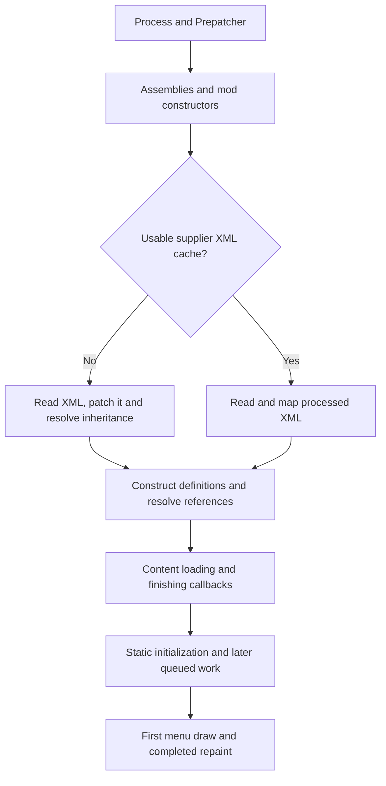

# Whole loading assessment — 2026-09-07

> Dated qualification record. Identities, activation defaults, permissions and proposed next steps describe this investigation, not the current release. See [current state](current-state.md), [support policy](user-guide.md#supported-build-policy) and [results](results.md) for current decisions.

The full suite shortened representative startup by **17.0–17.2% with fresh supplier caches** and **10.5–11.5% with warm caches**, after a temporary Loading Progress compatibility fix made all retained improvements reachable. A separate experiment combining unnecessary progress-repaint stops reduced two warm launches from roughly **14½ minutes to 7 minutes 43 seconds and 4 minutes**. The slower trial remains part of the result; texture-loading variability prevents a single reliable percentage for that experiment.

The representative workload revealed an important difference from the smaller XML-heavy tests: Loading Progress replaces part of the game's loading loop. Two accepted improvements could not operate on that replacement path. Gagarin XML reuse safely fell back because it did not recognize Loading Progress's attached code (hooks), while the PNG improvement never reached the texture-loading call it needed to intercept. Enabling every switch therefore did not enable every improvement in practice.

After a narrowly guarded compatibility bridge, a diagnostic run found a much larger remaining cost than the previously investigated small operations. Loading Progress repeatedly stops loading so another frame can repaint its progress display. In its finishing phase, the probe recorded 44.536 seconds inside the main update method and 661.814 seconds between updates, alongside 2,481 forced early stops. Time between updates includes rendering and other engine work; it is not automatically idle or removable time. The subsequent experiment tested this mechanism directly. A longer trace also located about 64 seconds in the first menu-drawing call, mostly CPU work; which shared operations account for it remains unmeasured.

The objective remains shared loading improvements across modlists. No gameplay mod was removed to improve a result, and no individual-mod initialization was cached or skipped.

The deliverable is this report. The accepted runtime and its exact package are restored, the fixture is closed, and the temporary compatibility bridge, repaint prototype and probes are removed from working source. Their source and raw captures remain recoverable. The narrow fixture-file restoration action is retained.

## Workload, identities and comparison rules

All launches use the single private `.rlo-test-instance`, its frozen representative order, normal texture-source selection, the independent menu observer and normal automatic exit. The representative absent arm has 315 active entries, including the observer; the candidate adds RLO for 316. The existing `astryl.moderndevtools` exclusion remains unchanged. Ordinary Steam/Workshop/profile/save/cache state was not modified; the Deck was not contacted. There was no UI automation, global cache eviction, security change, push or publication.

| Identity | Value |
|---|---|
| Initial local main | `ec2edce` |
| Accepted runtime source | `382996ca20863e2da88f7bb01758ecb9dacf3cbd` |
| Accepted DLL SHA-256 | `ef8e69ce0b5d13965be17cc7e73078487993c67c935761a4c3daa4b38575480a` |
| Initial bridge/frame-probe source | `fe5c9044a9e55293a90c8959609b349fa7122ab2` |
| Comparison/prototype source | `56612c63b01fc02018f16525e46608e70ba5a893` |
| Comparison/prototype DLL SHA-256 | `6df17da3ba67cecab0e0867d55ec77470e5f5aed2f97893add381efe9e07d52a` |
| Frozen manifest SHA-256 | `b9b53c8b666ae4d44cb02dc9d84b9ed6441d57b444b115ee1e38009529350f5d` |
| Game assembly SHA-256 | `4a170804fbfefabdb620d8914e584e58f822a58c6e304dcb76a67003588dab28` |
| Loading Progress | Frozen 0.14.0; DLL SHA-256 `4f19f836fd41c8e702295cb90d7d5e66c53f38cda8a13a3ed79f1d063e1afcef` |

The game log reports `1.6.4871 rev574`; the fixture's internal contract name remains the historical `gog-rev573`. The exact game assembly hash above identifies the exercised target. No different installed game was substituted to reconcile those labels.

Source revisions, built packages, deployed files and captured runs are separate facts. Package directories are `artifacts/op7-fixture-package/<full-revision>/`. Every preparation and capture records the intended deployed revision. A package identity on an absent record describes the parked package; that DLL is not discovered or executed by the absent game.

The full suite means candidate `startup-searches`, definition/template indexing, Harmony type indexing, `--gagarin-cache on` and `--png cache`. `--png-source original` is never used. The new bridge changes compatibility and the actual hook location; it does not replace the retained XML or PNG algorithms. Probe and repaint-experiment switches are off in suite timing arms.

Fresh application-cache construction and warm reuse are separate comparisons. Here, the supplier is Gagarin: it stores processed XML for later launches. Warm absent runs restore their own successful Gagarin cache, and warm candidates restore their own matching package's cache. A supplier cache can benefit the absent arm. Windows file caches are left alone: fresh application state does not mean cold storage. Reverse controls are required before interpreting the gap as a suite benefit.

### A runtime-written fixture file

The first baseline downloaded a newer `replacements.json` through an existing mod's ordinary startup behavior. The next preparation correctly refused metadata drift. Only that file changed in its package. A new `restore-runtime-file` fixture action preserves the live file in a recovery transaction and restores a source file only when its entire content matches the original frozen length and SHA-256. It restores the recorded timestamp too; it does not update the manifest or accept newer content.

The original Workshop file was read only and matched frozen SHA-256 `6c74ade7594ce8f350c7821ab691bbeaccae622989b4e21b6e3876799a942e2d`. Initial downloaded copies matched `6cc99dc6833c248bb319a397e3c2a8bde11be5b28050c7a711a2b0485e7a999b`. Per-run restoration receipts preserve the actual hashes. The network fetch remains part of the workload, so frozen selected files do not imply that every arbitrary startup callback has no external input. This maintenance is not a mod-specific performance improvement.

## Initial observations and integration failure

| Capture | Runtime/condition | Menu seconds | Interpretation |
|---|---|---:|---|
| `whole-f01-absent` | RLO physically absent; fresh supplier cache | 1370.030664 | Slow first observation; not a steady-state control |
| `whole-f02-suite` | Accepted package; all switches selected; fresh cache | 924.260737 | Normal startup, but not a fully active suite |
| `whole-p01-bridge-frames` | Initial bridge, fresh cache, frame probe | 941.783656 | Diagnostic/activation evidence; not an ordinary timing arm |

All three reached the independently observed menu and exited normally with `automaticTestPassed=true`. Their content order, seeded settings, original/processed XML hashes and normalized scanned error messages match. The only initially detected message difference was XML Extensions' printed elapsed milliseconds; its 16,878 operations and zero failures matched. Normal Mono fallback-library messages are not treated as new exceptions merely because generated library identities differ.

In the accepted candidate, definition lookup reported 13,497 hits, including 606 template hits, and 1,518 fallbacks. Its complete patch scope was 20.179 seconds. Type lookup reported 791 calls, 150 indexed fallbacks, seven index builds and 6.977 seconds of inclusive call time. These are stage facts, not a whole-suite percentage.

Gagarin explicitly refused Loading Progress's `CombineIntoUnifiedXML` hooks. PNG reported installation but zero holder-reload time: Loading Progress used a replacement iterator instead of the intercepted normal callsite. Zero PNG calls in that run did **not** prove that the PNG optimization was active but had no work.

The bridge checks Loading Progress's exact DLL, module identity and relevant loaded method bodies. It permits its reviewed observational XML hooks and redirects the texture-holder call inside its replacement iterator. Other unknown hooks still fall back. The initial bridge installed Gagarin successfully and reached the texture-loader bridge, with 16.830 seconds inside its reload wrapper and zero PNG/cache errors. Both timing-only fresh suites then recorded 316 optimized holder calls, zero bypasses, 39,975 selected DDS files and zero selected PNG files. Their complete wrapper costs were 8.416 / 8.343 seconds. This establishes actual activation with no eligible PNG work; it does not qualify PNG cache rendering through Loading Progress, because that path had no PNGs to exercise.

## Matched full-suite comparisons

### Fresh supplier-cache construction

These four timing-only runs used the same comparison package identity; RLO was physically parked for the absent arms. The cache was freshly constructed on every launch. Probe and repaint coalescing were off.

| Order | Capture | Mode | Independent menu seconds |
|---:|---|---|---:|
| 1 | whole-f03-absent (private: `artifacts/whole-loading/whole-f03-absent-summary.json`) | Absent | 1091.945396 |
| 2 | whole-f04-suite (private: `artifacts/whole-loading/whole-f04-suite-summary.json`) | Full suite with compatibility bridge | 904.209762 |
| 3 | whole-f05-suite (private: `artifacts/whole-loading/whole-f05-suite-summary.json`) | Same suite, repeated | 902.617396 |
| 4 | whole-f06-absent (private: `artifacts/whole-loading/whole-f06-absent-summary.json`) | Reverse absent control | 1087.359847 |

The forward pair saved **187.735634 seconds (17.19%)**; the second candidate versus its following absent control saved **184.742451 seconds (16.99%)**. Candidate repeats differed by 1.592366 seconds and absent controls by 4.585549 seconds. This supports a repeatable fresh-cache suite benefit on this representative workload and host condition. It is not a universal average, a PNG saving, or a result for the unmodified accepted package without the compatibility bridge. The large remaining frame-related interval also explains why a percentage from the earlier smaller XML-heavy workload cannot simply be carried over here.

All four completed normal automatic startup and matched frozen identity, selected content/order, seeded settings, observer, source selection, captured original/processed XML and normalized scanned error messages. Definition/template lookups recorded 13,497 hits and 1,518 fallbacks in each candidate, with 606 template hits. Gagarin reuse was installed but had no existing supplier cache to reuse. Type lookup was active; PNG interception was active but selected no PNG files.

### Warm supplier-cache reuse

All four warm timing arms restored their own matching supplier cache: absent runs from `whole-f03-absent`, suites from `whole-f04-suite`. The live supplier log confirmed cache loading in every arm; neither side constructed a fresh cache. Probe and repaint coalescing remained off.

| Order | Capture | Mode | Independent menu seconds |
|---:|---|---|---:|
| 1 | whole-h01-absent (private: `artifacts/whole-loading/whole-h01-absent-summary.json`) | Warm absent | 983.571816 |
| 2 | whole-h02-suite (private: `artifacts/whole-loading/whole-h02-suite-summary.json`) | Warm full suite with compatibility bridge | 870.314809 |
| 3 | whole-h03-suite (private: `artifacts/whole-loading/whole-h03-suite-summary.json`) | Same warm suite, repeated | 871.523316 |
| 4 | whole-h04-absent (private: `artifacts/whole-loading/whole-h04-absent-summary.json`) | Reverse warm absent control | 974.296652 |

The forward pair saved **113.257007 seconds (11.51%)**; the second candidate versus its following control saved **102.773336 seconds (10.55%)**. Candidate repeats differed by 1.208507 seconds and absent controls by 9.275164 seconds. Both directions support a warm-suite benefit under these conditions. Keep this result separate from the fresh-cache 17% result; the absent supplier cache has already removed much of the patch work in the warm comparison.

Both warm candidates reported admitted, reused Gagarin documents, one unchanged constructor call, one skipped XML serialization and zero duplicate parse time. Complete Gagarin stage times were 2.381 / 2.725 seconds. PNG again executed 316 optimized holders, selected 39,975 DDS files and no PNGs, with zero bypasses or cache/loader errors. Type indexing was active. Definition/template indexing remained enabled but had no indexed hits on this cache-hit path. No processed-PNG cache restoration was needed because this source selection generated no PNG entries.

The first warm absent/suite pair both loaded supplier XML from cache. Their scanned messages match each other. Relative to fresh runs, XML Extensions reports zero operations rather than 16,878 (both report zero failures), the cache-miss notice is absent, and eight earlier SafePatcher missing-target messages are not repeated. These are consequences of skipping the original patch work. The analysis preserves those fresh/warm differences and uses the warm absent run as the warm error-message reference.

Loading Progress also reports `defsParsed=47388` in fresh runs and `45388` in both first warm arms. Its counter (private: `artifacts/whole-loading/LoadingProgress-session-stats.cs`) records a stage's advertised maximum, taken from the native loading-progress label (private: `artifacts/whole-loading/LoadingProgress-window.cs`), rather than counting final objects in the definition database. It is not a final-definition checksum. The report checks it within the same cache condition and does not claim complete runtime-object equivalence from it or from matching XML files alone.

## Where the remaining time goes

Loading is more than reading XML. The process loads compiled code libraries (assemblies), constructs mods, processes data, resolves links between definitions, acquires assets, runs delayed initialization and finally draws the menu. Mod constructors create each mod's startup object; static initialization runs startup code associated with classes. Delayed callbacks are functions queued to run after earlier work finishes. Some work is nested inside other timers or runs on several threads. Those measurements cannot be added into a single total.

### The frame-stepped finishing loop

Loading Progress's `ReloadContentIntReplacement` is a sequence that can pause between steps (an iterator). It yields control before and after audio, textures, strings and asset bundles: eight yields per mod. Its finishing iterator requests an immediate repaint for these yields. Its patch to `LongEventHandler.UpdateCurrentEnumeratorEvent` can therefore end a frame before the game's ordinary 100 ms time limit is reached.

The initial probe measured the actual `Root.Update` boundary and the actual `ShouldStopEarly` result. It preserved original callbacks, returns and exceptions. The finishing phase contained 2,677 observed frames, 44.536 seconds inside updates, 31.047 seconds of calling-thread CPU and 661.814 seconds between updates. It recorded 2,481 early stops in that phase; the whole trace recorded 2,563 repaint requests and 2,482 early stops, with no dropped records or observed frame exceptions.

These are instrumented scopes, not a complete account of every function called in a frame. Other attached code that runs before the probe's observation point can fall into the time between scopes. The menu-drawing timer has the same boundary limitation. Time labelled outside an update therefore includes unmeasured surrounding work as well as rendering or waiting; it must not be presented as a pure idle or rendering total.

The median finishing-phase gap was 253.246 ms; 2,429 of the 2,677 gaps were between 200 and 300 ms (10th/90th percentiles 216.260 / 266.834 ms). That regular spacing is consistent with a low frame cadence in this background workload, but the probe does not identify a driver limit, graphics wait or other specific cause. The fixture records `runInBackground=true`; no foreground focus or external frame-rate setting was changed.

The probe began during RLO construction and stopped at loaded data plus an empty native event queue. Its 858.874-second covered interval does not include all bootstrap work or the actual menu endpoint. That stopping condition was too early for the entire-loading question. The later version uses native Windows counters, observes the first menu drawing calls and continues until the independent observer's menu signal. It can separate late drawing work from an unexplained remainder without changing the observer.

This differs from the earlier unexplained-delay investigation: that smaller workload did not use this Loading Progress replacement loop. Its absence of long gaps did not establish that the representative path had no frame-related delay.

### Repaint experiment and the newly located late interval

The diagnostic whole-p02-coalesce-verify (private: `artifacts/whole-loading/whole-p02-coalesce-verify-summary.json`) reached the independently observed menu in **241.949873 seconds** and exited normally. It suppressed 2,463 extra stop decisions with zero refusals. The probe still observed 2,563 repaint requests, but no resulting early-stop returns. Gagarin verification found the same source parse, 45,388 roots, 45,072 expected mappings, zero bad mappings and zero ownership errors. The selected textures and available XML/error checks matched the warm comparison workload. No frames were dropped and no observed frame or menu-drawing exception occurred.

| Finishing-phase observation | Initial uncoalesced diagnostic | Coalesced diagnostic |
|---|---:|---:|
| Measured update frames | 2,677 | 213 |
| Seconds inside update scopes | 44.536 | 37.044 |
| Calling-thread CPU seconds inside those scopes | 31.047 | 31.047 |
| Seconds between update scopes | 661.814 | 26.618 |
| Observed early-stop returns | 2,481 | 0 |

The diagnostics have different cache/probe conditions, so this table explains the frame mechanism; it is not the paired whole-startup speed claim. The original loading calls and native elapsed-time predicate remain in place. Normal progress requests still occur, while many no longer force their own frame boundary.

The extended trace accounts for the coalesced diagnostic's complete elapsed time as follows. These rows partition the clock interval; they are not sums of overlapping function timers. A row's event label describes the queue state at the observation boundary and can include surrounding hooks or background work.

| Disjoint observed interval | Seconds |
|---|---:|
| Launch to first observed update | 9.083 |
| Earlier frames without a queued native event, including background loading | 42.309 |
| Loading Progress finishing phase | 63.662 |
| Loading Progress static-initialization phase | 45.791 |
| Other queued phases | 16.929 |
| Loaded/empty queue through actual menu readiness | 64.176 |
| **Complete independent menu time** | **241.950** |

The last interval is now located much more closely: the first observed `MainMenuOnGUI` invocation took **64.053339 seconds**, including **61.656250 seconds of calling-thread CPU**. The next invocation took 0.005223 seconds. The probe did not record GUI event type; the independent observer still determines the first completed repaint. Thus substantial late initialization is CPU work in the first menu-drawing scope. Which shared operations inside it are expensive remains unmeasured. The analysis clips the 0.017182-second post-menu tail rather than including it in startup.

### Timing-only repaint trials

These trials keep the full bridged suite, native texture selection and supplier cache from `whole-f04-suite`. The frame probe and Gagarin verification are off. No source or package change separates the timing arms.

| Capture | Repaint coalescing | Menu seconds | Texture-holder seconds |
|---|---|---:|---:|
| `whole-h03-suite` | Off; preceding warm suite | 871.523316 | 8.554749 |
| whole-p03-coalesce (private: `artifacts/whole-loading/whole-p03-coalesce-summary.json`) | On | 462.535953 | 186.679963 |
| whole-p04-coalesce (private: `artifacts/whole-loading/whole-p04-coalesce-summary.json`) | On, repeated | 240.438655 | 9.373120 |
| whole-p05-suite-control (private: `artifacts/whole-loading/whole-p05-suite-control-summary.json`) | Off; following control | 871.976522 | 8.352838 |

The slower first timing trial is retained in the result. It actually suppressed 2,347 stops, with zero refusals; the second suppressed 2,458, also without refusal. Its 186.680-second texture-loader cost explains much of the gap from the four-minute diagnostic/repeat. It also had an earlier slowdown: vanilla loading took 20.918570 seconds and the observer installed at 31.067633 seconds, versus roughly eight seconds for observer installation in nearby suite runs. That early delay precedes the optimizer's mod-stage behavior. Sampled game CPU remained similar: 310.828 seconds in the slow trial, 305.531 in the diagnostic and 308.750 / 313.891 in the preceding warm suites.

These observations do not isolate the cause of the texture delay or prove whether faster batching can affect it. No cache was globally evicted, no external application was changed, and the run is not discarded as an outlier. The following control returned to 871.976522 seconds, within 0.453206 seconds of the preceding warm suite. It also matched the available content, XML and error checks, confirmed supplier reuse, and recorded zero texture-loader/cache errors.

The first timing candidate saved **408.987363 seconds (46.93%)** against `whole-h03-suite`; the repeat saved **631.537867 seconds (72.43%)** against its following `whole-p05-suite-control`. The earlier control was not immediately adjacent: the reverse absent run and diagnostic intervene before the first timing candidate. The matching package/cache policy and stable preceding/following suite times support a substantial workload-specific benefit, while the candidate variation prevents treating 72% as a dependable expectation. The two timing candidates and following control use no diagnostic replay. This experiment is preserved for further qualification, then removed from the accepted runtime for this report-only closeout.

### Other costs and limits

The following matched fresh-cache observations show where the suite changes work. Loading Progress's per-mod values are sums within the named category. The RLO patch timer covers the complete original patch method, so its 21.201 seconds is slightly larger than the suite's 20.822-second per-mod patch sum. Worker-thread registration time is deliberately excluded from the main-thread row.

| Measured scope, seconds | Absent `whole-f03` | Suite `whole-f04` |
|---|---:|---:|
| Per-mod XML patch work | 106.059 | 20.822 |
| Mod constructors | 49.363 | 16.346 |
| Static initialization | 77.946 | 22.374 |
| Mod XML definition loading | 2.117 | 1.976 |
| Mod XML patch loading | 0.466 | 0.503 |
| XML combination | 1.586 | 1.620 |
| XML processing (`ParseAndProcessXML`) | 11.073 | 11.027 |
| XML inheritance | 0.523 | 0.622 |
| Main-thread definition registration | 0.774 | 0.602 |
| Definition reference resolution | 3.382 | 3.414 |
| Ordinary cross-reference resolution | 0.275 | 0.292 |
| Texture-holder loading | 9.927 | 8.420 |
| Audio loading | 4.711 | 5.163 |
| Asset-bundle loading | 0.546 | 0.541 |
| String-content loading | 0.051 | 0.045 |
| Atlas baking | 2.621 | 3.001 |
| Sampled process CPU, across all threads | 530.984 | 340.531 |

These scopes overlap and must not be added. The constructor/static-init changes are consistent with the enabled shared type index; this combined-suite comparison does not isolate each feature's causal contribution. The suite's type receipt records 7.015 seconds inside its 791 calls. The remaining 11-second XML processing cost does not prove 11 seconds can safely be removed, and the 8–10-second native texture cost does not represent PNG decoding. Earlier much slower texture observations remain first-read/host-variation evidence rather than the current repeated-reading ceiling.

The same suite's early log reports 1.923153 seconds for the initial vanilla load, 0.352321 seconds for Prepatcher's game processing and 1.165738 seconds writing patched assemblies. The independent observer installed 8.062196 seconds after launch. These early costs are already inside the 904.210-second menu result. The later Unity unused-asset cleanup reported 0.973051 seconds, mostly finding which objects were still live. That specific cleanup is real work, but it does not explain the much longer finishing interval. These observations support reporting assembly/discovery/cleanup costs without inventing a large removable budget from them.

Warm supplier reuse changes the remaining XML budget substantially. The first warm absent run spent 3.765 seconds in `ParseAndProcessXML`; the two warm suites spent 4.226 / 3.632 seconds. Inheritance was about 4 ms in all three. The suites' residual patch paths took 19.306 / 21.138 ms, with two ordinary fallbacks and no indexed hits. Their type-call totals remained 7.123 / 7.171 seconds. Constructor/static-init totals were 51.310 / 80.490 seconds in the warm absent arm versus 16.289–17.552 / 22.400–22.568 seconds in the two suites. These are separate, overlapping scopes, but they establish that another XML-patch optimization primarily concerns cache misses here.

The first absent run sampled about 6.35% aggregate host CPU use and retained at least 8.2 GiB of available RAM. A one-off host snapshot showed background ChatGPT, media playback and other activity; this was not an isolated idle-machine benchmark. Aggregate counters do not rule out brief contention, storage effects or graphics delays. Process read counters are not measurements of physical disk reads or page-fault latency.

## Ranked generalizable opportunities

### 1. Combine unnecessary repaint stops — substantial measured benefit, further qualification needed

**Avoidable work:** forcing a separate frame between short or empty loading steps. **Mechanism:** let the existing iterator continue under its unchanged 100 ms time budget instead of honoring every additional early-stop request. The original loader calls, queue order, exception behavior and required initialization remain in place; intermediate progress labels may share a repaint.

**Evidence:** the measured thousands of early stops and 661.814 seconds outside updates in the representative finishing phase. This is a different mechanism from rejected DDS/PNG read-ahead, worker-count changes or parallel XML preparation. It reduces the number of forced frame boundaries rather than reading the same files earlier.

**Limits:** the prototype is restricted to the reviewed Loading Progress version and known hooks, and stops affecting loading when the menu is drawn. Its benefit depends on the actual frame cadence; the roughly quarter-second gaps in this background workload must not be assumed for foreground loading. Other engines/versions and arbitrary gameplay are not qualified. Individual expensive loader calls can still block; the unchanged 100 ms limit cannot preempt one such call. Other mods can observe frame boundaries, so successful startup and matching data are narrower than universal compatibility.

**Decision:** the diagnostic confirmed fewer forced stops and matching available work/data checks; both timing-only candidates beat stable preceding/following suite controls. Preserve the prototype as the strongest measured opportunity. Before promotion, check its behavior with other frame-sensitive loading hooks and ordinary foreground cadence, and establish whether texture-delay variability changes its practical benefit. Do not broaden the experiment into another profiling framework. The current task's report is complete without that additional qualification.

### 2. Keep shared type searches active through first menu initialization

**Avoidable work:** expensive fallback type-name searches after the optimizer currently marks startup complete. `TypeLookupRuntime.MenuUpdate` uses loaded data and an empty native event queue, the same condition that ended the initial frame probe before the actual menu repaint.

**Mechanism:** keep the existing bounded general index alive through the real endpoint if meaningful eligible searches occur in that interval. This would extend the shared search lifetime; it would not cache an individual mod's presets or initialization results.

**Evidence and limits:** the extended `whole-p02-coalesce-verify` trace measures 64.176 seconds from the old loaded/empty-queue condition to the real menu endpoint. Its first observed menu-drawing call takes 64.053 seconds, including 61.656 seconds of calling-thread CPU. This locates substantial late CPU work, but does not establish how much uses the shared type-name API. No part of that entire minute should be called predicted savings. Keeping indexes longer also retains memory and requires continued assembly-generation and hook invalidation.

The existing type receipt's reason text says `constructor-to-menu-ready`, but [its actual completion condition](../src/RimWorldLoadingOptimizer.RimWorld/TypeSearch/TypeLookupRuntime.cs) is earlier. Its receipt must not substitute for the independent observer's menu endpoint.

**Smallest useful test:** count and time ordinary shared type-search calls between the old cutoff and the first completed menu repaint. Stop if their eligible cost is small. This differs from the removed CharacterEditor-specific optimization and from the rejected Harmony emission rewrite.

### 3. Plan finite-name XML queries in one pass

**Avoidable work:** checking the same chain of literal-name alternatives repeatedly for unrelated XML roots. **Mechanism:** recognize a bounded set of `defName` or template-name equalities, scan roots once and retain ordinary suffix evaluation and mutation bodies.

**Evidence:** fresh representative candidates still spend around 20 seconds patching, with 1,518 fallbacks. Historical eligible-looking Replace/Remove families took hundreds of milliseconds on the smaller selection, but those inclusive family totals did not isolate this exact query subset. The current eligible cost remains unmeasured.

This is a serial reduction in comparisons, not the rejected parallel query splitting. Preserve real node identity/order, duplicate names, multiple `defName` children, namespaces and invalidation. Initially exclude Add's live-iterator behavior. The opportunity largely disappears on a supplier processed-XML cache hit.

**Smallest useful test:** replay supported selection shapes on captured real documents, comparing node identity/order and complete selection cost, then run a bounded live miss-path comparison if promising. Captured post-patch XML cannot reproduce removed historical targets or prove historical execution time.

### 4. Reuse unchanged portions of the existing type index

**Avoidable work:** rebuilding indexes for unchanged static assemblies when new assemblies arrive. **Mechanism:** retain eligible immutable per-assembly segments while still observing original assembly order and rereading genuinely dynamic assemblies.

**New premise:** the representative candidate records about seven seconds across 791 type calls, seven index builds and 1,001 dynamic-assembly reads; the earlier small-workload ceiling was only about 0.3 seconds. The larger measured total reopens a cost question, not a demonstrated index-rebuild bottleneck.

**Limits:** total type-call time includes work beyond rebuilding. Preserve full-name-before-simple-name precedence, exception handling, publication invalidation and resource bounds. Dynamic type creation and foreign hooks prevent treating all segments as immutable.

**Smallest useful test:** separate rebuild, dynamic enumeration, indexed selection and retained original fast-path time in one bounded representative observation. Implement segment reuse only if a meaningful complete cost is actually there.

### 5. Reassess exact DDS-cache validation with native hashing

**Avoidable work:** the expensive managed hash implementation in the [rejected validated DDS pack](archive/investigation-results.md#2026-09-07-texture-implementation-experiments). **Changed premise:** [retained PNG work](archive/investigation-results.md#2026-09-07-png-processing-implementations) demonstrated much cheaper Windows-native computation of the same SHA-256, including actual Mono execution and byte-equivalence checks. That directly addresses one recorded reason the old pack lost.

The earlier pack paid about 2.9 seconds during installation/full-pack validation and roughly 2.8 seconds of additional DDS-stage cost versus following controls. Those numbers are historical, not current representative costs. Faster hashing does not remove the requirement to read every current source or validate cached payloads; it cannot honestly be described as eliminating all original file opens or reads.

**Limits:** fresh construction, duplicated I/O, texture creation/upload and storage remain real costs. Cache correctness must retain complete source/payload validation and normal unsupported-path fallback. Do not revive the same managed-hash design or claim a gain from shorter nested texture-creation timing alone.

**Smallest useful test:** replace only hashing in the preserved prototype, measure complete validation/acquisition cost on the same runtime, and stop if matched whole-startup controls erase the benefit. Natural first-read behavior remains a separate question; no global cache eviction is justified.

### Lower-priority areas

- **XML conversion and inheritance:** current full costs merit reporting, but the prior direct-field-store and inheritance measurements do not support another broad rewrite. Preserve constructors, custom parsers, reference registration and XML ownership. A larger outer timer does not identify a safe removable inner operation.
- **Reference resolution and post-load work:** shared filters and graphics preparation can be real costs, but summed worker timers are not elapsed loading time. Existing registration/ancestry/filter experiments remain adequate until a specific larger repeated operation is demonstrated.
- **Textures and atlases:** the native DDS path avoids PNG decoding and supports already compressed texture blocks. Atlas rendering still requires real pixels. Previous pooling, layout and transfer experiments did not establish a repeatable complete gain. A new proposal needs an actual avoidable operation, not the whole texture timer as its target.
- **Audio:** the full workload has measurable audio loading, but no current evidence shows eligible repeated decoded content or a safe cache mechanism worth its construction/storage costs. Existing within-sound reuse found no repeated key on its measured selection; the full selection remains a separate eligibility question.
- **Assembly/bootstrap:** current Prepatcher serialization is about a second in initial representative logs. Unchanged assemblies already reuse bytes. Arbitrary mod patch callbacks and external inputs make persistent transformed-assembly reuse a substantial correctness problem; repeated serialization parallelism is not justified by the recorded small non-game-write ceiling.
- **Cleanup:** preserve required unloading and collection. A final cleanup timer alone does not establish avoidable allocation, and removing cleanup can merely move cost or retain memory.

## Verification, experimental status and restoration

The comparison package passed 56 managed and 25 Python fixture checks; its build had zero warnings/errors. An initial fixture-test setup failure and a later compilation error were corrected before the comparison package was built. Their logs remain preserved. The fixture repair test checks refusal of newer source bytes and unlisted paths, source preservation, and recovery of the overwritten live version.

All **15 representative launches** reached the independent menu endpoint, exited normally with code zero, were captured and passed `automaticTestPassed`. All matched the available content/order/settings, observer, original/processed XML and same-cache-condition scanned error checks. Initial preparation and compilation failures are preserved separately; they are not failed live launches or successful test evidence. The diagnostic also checked Gagarin source parsing, mappings and ownership. These checks do not prove complete in-memory object equivalence or arbitrary gameplay compatibility.

Removal commit **`8bedddc98ff29e52775f563b37dc5133dbac2518`** restores every file under `src/` exactly to accepted source `382996ca20863e2da88f7bb01758ecb9dacf3cbd` and removes experimental fixture selectors. The frozen-file maintenance action and its corrected test remain. All **25 Python fixture checks** passed after restoration. The existing accepted package was deployed successfully rather than rebuilt under a misleading new source identity; both packaged files were checked against their recorded size and complete SHA-256. The deployed runtime DLL is again `ef8e69ce0b5d13965be17cc7e73078487993c67c935761a4c3daa4b38575480a`.

The separate small native-selection restoration capture **`restored-whole-native`** used the `xml-expanded` lane, reached the menu in **22.828391 seconds**, exited with code zero and passed automatic capture at `2026-09-07T10:24:40Z`. It matched the preceding accepted native capture `png-n04-integrated-native` in content/order/settings, observer, XML and scanned errors. Gagarin was enabled in this restoration check, whereas that older capture had it off; this is restoration evidence, not a new paired performance claim. PNG selected no eligible work and reported zero loader/cache errors. The fixture game was verified closed and the runtime-written file restored to frozen bytes.

Restoring accepted code also restores its known representative Loading Progress limitation: Gagarin refuses those unrecognized hooks and the normal PNG interception does not reach the replacement iterator. The temporary bridged-suite percentages must not be attributed to the currently deployed unmodified package. The compatibility bridge and repaint experiment remain at source `56612c63b01fc02018f16525e46608e70ba5a893` for deliberate future qualification. No probe or prototype speed claim implies gameplay, other-modlist, latest-Steam or cross-platform qualification.

Raw evidence: analysis (private: `artifacts/whole-loading/analysis.json`), run helper (private: `artifacts/whole-loading/run.py`), analysis helper (private: `artifacts/whole-loading/analyze.py`), probe/package tests (private: `artifacts/whole-loading/comparison-package-tests-final.log`), package build (private: `artifacts/whole-loading/comparison-package-build.log`), Loading Progress replacement source inspection (private: `artifacts/whole-loading/LoadingProgress-reload-replacement.cs`), finishing loop inspection (private: `artifacts/whole-loading/LoadingProgress-finish.cs`), and early-stop inspection (private: `artifacts/whole-loading/LoadingProgress-enumerator.cs`). Authoritative private captures remain under `.rlo-test-instance/results/<label>/`. These ignored artifacts are local evidence, not public package contents.

The closeout receipt (private: `artifacts/whole-loading/closeout.json`) records all representative labels, final source/package verification, the restoration capture, frozen-file receipt and closed-process check. The investigation began from local main `ec2edce` on `codex/whole-loading-assessment`; its report and restoration are integrated into local main after closeout. No push or publication occurred.
